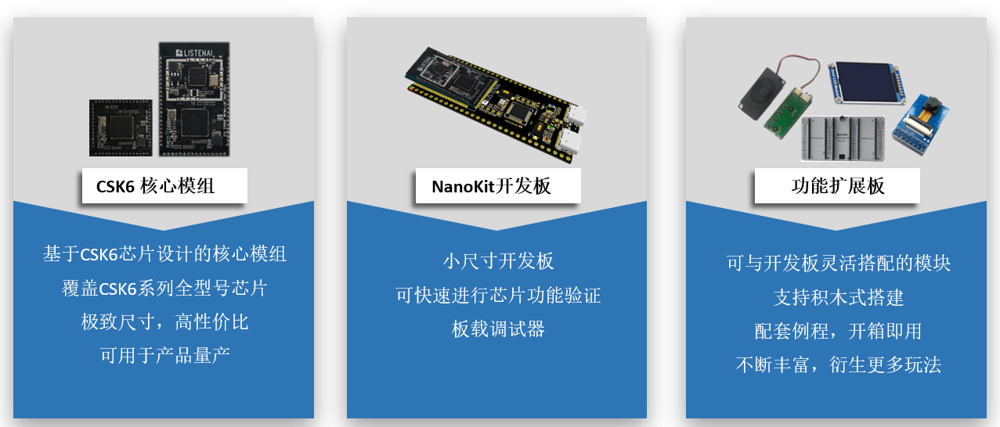

# NanoKit开发套件

## 产品简介

NanoKit开发套件是聆思科技针对自研AI芯片 —— CSK6系列推出的开发板与配件组合方案，通过NanoKit开发套件，您可以根据需求选用对应的芯片模组、开发板与功能配件，快速便捷地组合出完整的产品原型。搭配丰富的固件例程与完善的文档，您可以基于CSK6芯片快速玩转AI应用。

NanoKit 开发套件具备以下特性：
- 上手简单，硬件开箱即用，文档与例程配套完善
- 硬件资源丰富，满足开发过程中的各类功能验证、调试需求
- 高度灵活，搭配功能扩展板可衍生丰富玩法，构建完整的语音、视觉开发套件

## 硬件组成

NanoKit 开发套件按功能划分为**核心模组**、**NanoKit开发板**与**功能扩展板**。

### 核心模组

核心模组是集成了CSK6系芯片及其外围最小电路的单元，在NanoKit开发套件中一般直接与NannoKit开发板配合使用。

核心模组具备以下特性：
- 小尺寸，窄孔距，邮票孔
- 引脚全引出
- 可直接用于产品的量产

### NanoKit开发板

NanoKit开发板板载CSK6核心模组以及上手开发常用的硬件外设(如LED、按键、调试器等)，并将可用引脚全部引出至排针，方便用户快速进行应用开发与验证。

当前套件中的NanoKit开发板(含模组)型号有：

| 型号 | 特性 |
| -------- | ------ |
| [csk6002-9s-nano](./nanokit_csk6002_9s_nano) | 板载CSK6002+XR819S模组，CSK6002内置8MB Flash |
| [csk6011a-9s-nano](./nanokit_csk6011a_9s_nano) | 板载CSK6011A+XR819S模组，模组集成16MB Flash |

### 功能扩展板

为方便开发者使用NanoKit套件快速搭建出最接近产品形态的硬件原型，套件提供了一系列支持即插即用的功能扩展配件，配合固件例程可以快速搭建出丰富且完整的应用。

当前套件中支持的功能扩展板有：

| 型号 | 特性 |
| -------- | ------ |
| 引脚扩展底板 | 提供三组排针扩展，方便硬件调试与接入其他扩展板 |
| [语音功能板 v1](./nanokit_audio.md) | 集成麦克风、喇叭电路，方便进行语音业务的开发 |
