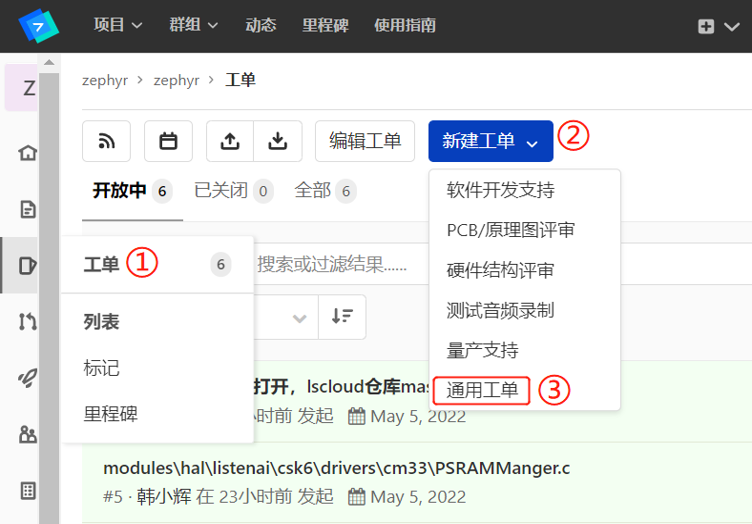
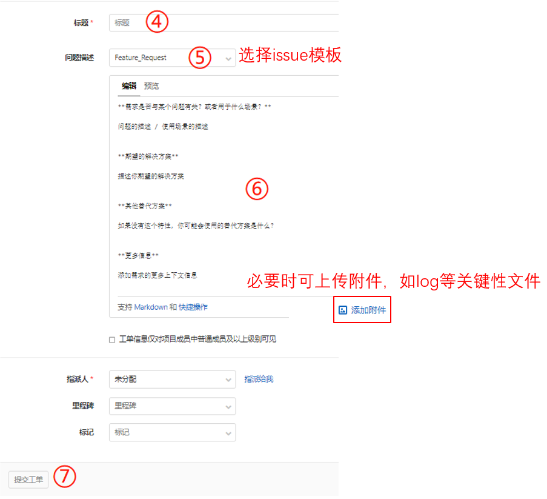
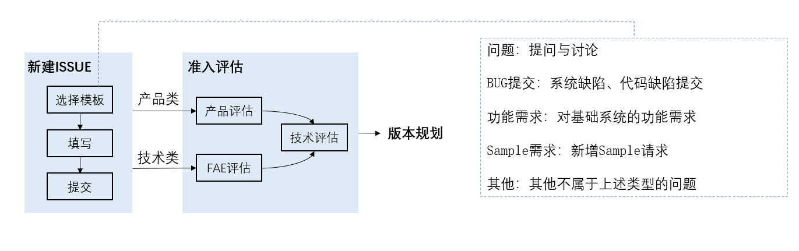

# 提交新问题

在使用CSK6 SDK进行业务开发的过程中，你可能会遇到以下情况：
- 在使用某个功能模块时有疑惑
- 在代码中发现BUG，希望进行反馈
- 有希望新增的功能支持
- ……

你可以通过LSCloud与我们建立联系，反馈以上问题。

## 提交步骤
- Setp1：访问[SDK托管平台](https://cloud.listenai.com/zephyr/zephyr)， 点击右上角图标进行登录
- Setp2：点击左侧工具栏，点击工单，依次选择 【新建工单】-> 【通用工单】

- Setp3：在工单填写页面中，根据不同的反馈类型在【问题描述】选择不同的issue模板，目前我们提供【问题】、【BUG提交】、【功能需求】、【Sample】这几种模板，按照模板提示填写完成后，可选择FAE作为指派人，并提交工单。

## 反馈处理流程
提交的反馈我们会根据类型不同采取对应的处理流程机制，提交的反馈在经过我们内部讨论与评审后，会根据评估结果确定处理方式，并及时在issue评论区中与您进行沟通，流程示意图如下：

您的参与，是我们前进的动力 ^_^