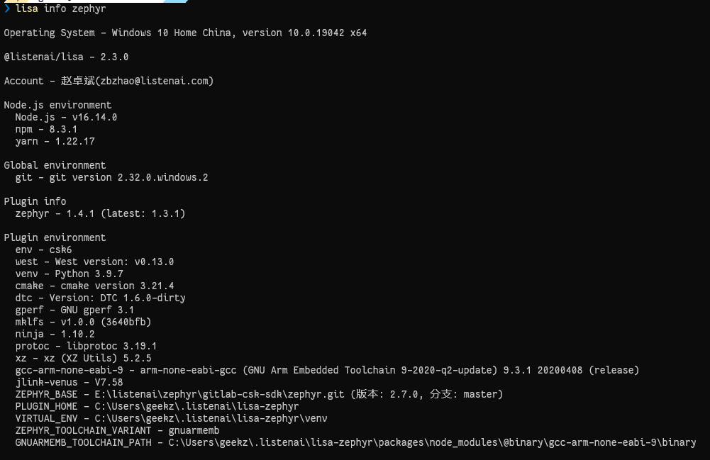

# 安装开发工具

## 获取 Lisa 并安装 Zephyr 开发环境

**WARNING**: 获取前，请现确保本机已经安装了 `git` 工具。


import Tabs from '@theme/Tabs';
import TabItem from '@theme/TabItem';

<Tabs
    defaultValue="win"
    values={[
        {label: 'Windows', value: 'win'},
        {label: 'macOS、Ubuntu', value: 'mac'}
    ]}
>
  <TabItem value="win">
    
<p>1. 下载 <a href="https://castor.iflyos.cn/castor/v3/lisaPluginZephyr/download?platform=windows">Lisa & Zephyr Installer</a> 并运行；</p>

<p>2. 根据安装引导进行安装。</p>

**NOTE**: **Lisa & Zephyr Installer** 是面向Windows操作系统的开发的CSK6开发环境一体化安装包，支持SDK一键拉取与配置，方便开发者快速构建开发环境。

  </TabItem>
  <TabItem value="mac">
    
<p>1. 安装lisa & lisa plugin zephyr</p>

在 **用户权限** 下执行：

使用 curl

```bash
curl -o- https://cdn.iflyos.cn/public/cskTools/lisa-zephyr-install.sh | bash
```

或使用 wget

```bash
wget -qO- https://cdn.iflyos.cn/public/cskTools/lisa-zephyr-install.sh | bash
```

<p>2. 安装 zephyr 对应环境</p>

```bash
lisa zep install
```

  </TabItem>
</Tabs>

打开终端，执行你的第一个lisa命令，检查当前开发环境吧~

 ```bash
lisa info zephyr
```


`lisa info zephyr` 指令用于查看当前 Zephyr 的环境。在后续的开发上，该命令也可作为环境自检的一个方式。若在环境检测过中存在工具缺失的情况，请参照FAQ章节进行解决或联系我们。

新搭建的环境，如下图：


**NOTE**: 除 `env` 和 `ZEPHYR_BASE` 外，其余环境项均安装成功，

若存在未安装的，自行执行 `lisa zep install` 重新安装。

## 拉取 CSK6 SDK

```bash
lisa zep use-sdk --default
```

**NOTE**: 该命令会在 `~/.listenai` 目录下，拉取 SDK 并进行初始化。

若需要更改 SDK 默认存放路径，可执行:

```bash
lisa zep use-sdk ./my-zephyr-sdk --default
```

## 配置 CSK6 编译环境

```bash
lisa zep use-env csk6
```

**NOTE**: 该命令会安装设置好 csk6 相关的编译环境。

此时再执行 `lisa info zephyr`，查看当前的 Zephyr 环境吧~


