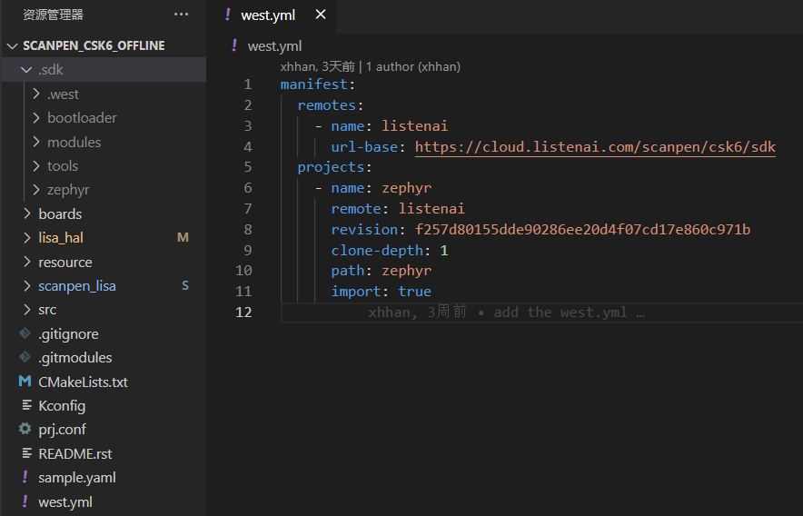

# 应用级提货单

通过该章节，你可以了解到 `应用级提货单` 相关概念。

当应用项目包含提货单时，可不设置全局的 SDK 。

:::info
如果你对提货单相关概念比较模糊，可查阅 Zephyr 官方文档的 [Manifests章节](https://zephyr-docs.listenai.com/guides/west/manifest.html) 进行了解。
:::

:::tip
该功能特性仅在 lisa zep 工具 `1.5.1` 及以上版本支持，执行 `lisa info zephyr` 检查本地的工具版本，并可通过 `lisa update zephyr` 更新到最新工具版本。
:::

## 应用获取

提供两种方式进行应用的获取并初始化。

### 通过 lisa zep create

下面使用一个应用级的 `hello_world` 项目来直观地感受。

```shell
lisa zep create --from-git https://cloud.listenai.com/listenai_zbzhao/test_sample.git
```

创建项目时，可带 `--from-git` 参数，并带上远端的项目仓库。按流程执行后，会基于该仓库，进行项目的初始化，等待执行完毕，你会获得如下的目录结构。



- `scanpen_csk6_offline` 目录下，为一个应用级的项目。

- 提货单的project均存放在 `.sdk` 目录中。

- 配置存放在 `.sdk/.west/config` 中，如图中所示，提货单为 `./west.yml`，整个项目都基于该提货单进行拉取对应modules。该项目的 sdk 代码存放在 `.sdk/zephyr` 中。

- 其余目录均为提货单中配置的该项目所需。

### 本地初始化

若本地已经存在一个应用级项目，需要初始化。比如：

```shell
git clone https://cloud.listenai.com/listenai_zbzhao/test_sample.git
```

此时可以 `cd` 到 `test_sample` 目录下，执行：

```shell
lisa zep init-app
```

命令执行完毕后，你能获取一个初始化好的应用级项目，与上述通过 `lisa zep create` 获取的目录结构是一样的。


## 应用编译

应用级项目的编译，需要在项目中进行，如上述的例子，需要在 `test_sample` 目录下进行项目的编译操作。

## 制作应用级项目

在原有的项目中，根目录添加 `west.yml` 提货单即可。