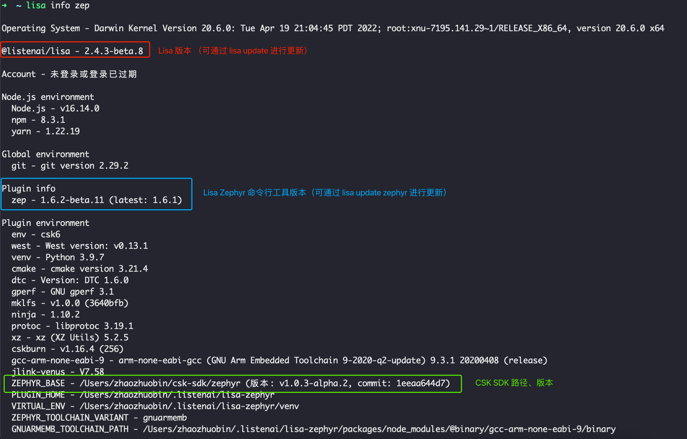
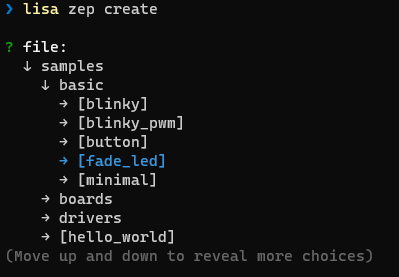

# 基础命令

本章介绍 `lisa zep` 一些常用的基础命令，让你快速了解到如何使用 `lisa zep` 工具进行 CSK 应用的开发。


## 终端命令行补全

lisa zep 目前支持以下平台和 shell 组合中的补全：

- Linux：bash

- macOS：bash

- windows：暂不支持

执行：

```bash
lisa completion-install
```


## lisa info zep

```bash
lisa info zep
```

该命令可以查看 `lisa zep` 工具当前的环境，以便于开发者检查和确认当前的开发环境版本等信息。




## CSK SDK 操作

```bash
lisa zep sdk
```

该命令为 sdk 的管理命令，执行后会根据当前环境，提供 sdk 的拉取安装和版本切换等操作.

## 创建项目
通过上述的步骤，你终于完成应用开发的前步骤了，接下来就是创建项目进行开发了，命令如下：

```bash
lisa zep create
```



使用 上下键 操作，左右键/空格键 打开/关闭 文件夹， 回车键 确认选择。

选择想要创建的sample工程后，可以修改创建的文件夹名，默认为该sample工程原来的名字。

或者使用单命令进行创建:

```bash
lisa zep create [target] --from <sample>

例如：

lisa zep create blinky --from ~/.listenai/csk-sdk/zephyr/samples/basic/blinky
```

## 其他

有关`lisa zep`命令其他的信息，请阅读以下页面：

[内置命令](../lisa_plugin_zephyr/command_detail.md)

[构建、烧录与调试](../lisa_plugin_zephyr/build_flash_debug.md)

[文件系统相关](../lisa_plugin_zephyr/filesystem.md)
