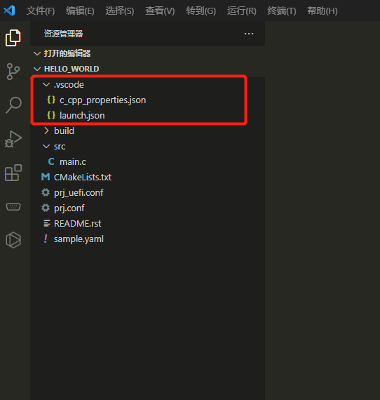

# 编译 烧录 调试

`lisa zep` 工具提供了几个扩展命令用于编译，烧录和调试项目。

## 编译

### 基础

转到应用程序的根目录（即包含应用程序的文件夹），命令如下：

``` bash
lisa zep build -b <BOARD>

例如：
lisa zep build -b csk6011a_nano
```

`<BOARD>` CSK SDK 支持的开发板，该命令会对当前 CSK 工程项目进行编译。另外是否支持所填的开发板，需要由 CSK SDK 支持。执行完毕后，编译产物会存放在当前目录下的 build 文件夹里。

### 设置工程项目路径

工程项目的路径可作为参数直接带上，支持相对/绝对路径，假设工程项目的绝对路径为：`E:\\my-zephyr-project\\blinky `
你可以在 `E:\\my-zephyr-project\\blinky` 目录下执行：

```bash
lisa zep build -b csk6011a_nano
```

### 设置编译产物输出路径

在执行编译命令时，可带上 `--build-dir` 参数，带上相对路径。引用上面例子，执行命令：

```bash
lisa zep build -b csk6011a_nano --build-dir ./build
```

该命令执行后，编译产物会存放到 `E:\\my-zephyr-project\\blinky\\build`

若不想每次都带上 `--build-dir` ，也支持更改默认编译产物输出路径：

```bash
lisa zep config build.dir-fmt "you_want_build_path"
```

比如无论在哪里执行编译命令，都希望编译产物存放在工程目录下的 build，可以执行：

```bash
lisa zep config build.dir-fmt "{source_dir}/build"
```

### 设置默认开发板

如果你不想每次烧录都带上 `-b` 参数，可以设置默认开发板：

```bash
lisa zep config build.board csk6011a_nano
```

设置好后，后续执行 `lisa zep build` 编译时，默认会基于 `csk6011a_nano` 来进行编译。

### 原始编译

抛弃原有编译缓存/产物，重新基于工程项目进行编译。

在执行编译命令时，带上 `--pristine` 或 `-p` 参数，比如：

```bash
lisa zep build -b csk6011a_nano -p
```

该参数是一个赋值参数，当不赋值时，默认值为 `always`，可选值和解释如下：

`auto` ：当检测到需要重新编译或编译会失败，则将编译产物文件夹恢复原始状态，进行编译

`always`：始终将编译产物文件夹恢复原始状态来进行编译

例子：

```bash
lisa zep build -b csk6011a_nano -p=auto
```
### 详细编译

要在终端打印更详细的 CMake 的编译信息，可以使用 `-v` 参数：

```bash
lisa zep -v build -b csk6011a_nano
```


### 一次性的 CMake 参数

`lisa zep` 允许将其他参数给到 CMake 调用，参数要放到 `--` 后面。

:::info
使用这种方式传递参数，会使 `lisa zep build` 重新运行 CMake ，即使是项目已经构建了。

在使用 `--` 生成构建 build 目录后，后续可使用 `lisa zep build -d <build-dir>` 来进行增量构建。
:::

例如，Makefile 生成器使用 CMake 的 Unix Makefiles ，而不是默认的 Ninja：

```bash
lisa zep build -b reel_board -- -G'Unix Makefiles'
```

又比如，使用 Unix Makefiles 并将 [CMAKE_VERBOSE_MAKEFILE](https://cmake.org/cmake/help/latest/variable/CMAKE_VERBOSE_MAKEFILE.html) 设置为 ON:

```bash
lisa zep build -b reel_board -- -G'Unix Makefiles' -DCMAKE_VERBOSE_MAKEFILE=ON
```

**注意**，`--` 只需传一次，即使是给出多个 CMake 参数，`--` 后所有参数都会通过 `lisa zep build` 给到 CMake。

将 [DTC_OVERLAY_FILE](../../application/application_development.md#引入构建系统变量) 设置为 `enable-modem.overlay`, 使用 `enable-modem.overlay` 文件作为 [设备树 overlay](../../build/dts/intro.md):

```bash
lisa zep build -b reel_board -- -DDTC_OVERLAY_FILE=enable-modem.overlay
```

将 `file.conf` kconfig 片段合并到 build 中的 `.config`:

```bash
lisa zep build -- -DOVERLAY_CONFIG=file.conf
```

### 永久性的 CMake 参数

如果你想保存 CMake 参数以供 `lisa zep build` 在每次生成新的构建系统时使用，你应该配置 `build.cmake-args` 参数。

**请注意**，默认情况下，如果你构建目录中存在新的构建系统，则 `lisa zep build` 会尝试避免生成新的构建系统。因此，你需要删除现有的构建目录或在设置 `build.cmake-args` 后进行[原始编译](build_flash_debug.md#原始编译)已确保其生效。

例如，要始终启用 **CMAKE_EXPORT_COMPILE_COMMANDS**，你可以运行：

```bash
lisa zep config build.cmake-args -- -DCMAKE_EXPORT_COMPILE_COMMANDS=ON
```

（额外的 -- 用于强制将命令的其余部分视为参数。没有它，lisa zep config 会将 `-DVAR=VAL` 语法视为对其 `-D` 选项的使用。

要启用 **CMAKE_VERBOSE_MAKEFILE**，这会使 CMake 在构建系统时打印更详细的信息：

```bash
lisa zep config build.cmake-args -- -DCMAKE_VERBOSE_MAKEFILE=ON
```

`build.cmake-args` 要设置多个参数时，可以将参数放到一个字符串里。

例如，要同时启用 **CMAKE_EXPORT_COMPILE_COMMANDS** 和 **CMAKE_VERBOSE_MAKEFILE**，你可以运行：

```bash
lisa zep config build.cmake-args -- "-DCMAKE_EXPORT_COMPILE_COMMANDS=ON -DCMAKE_VERBOSE_MAKEFILE=ON"
```

如果你想将 CMake 参数保存在单独的文件中，可以将 CMake 的 `-C <initial-cache>` 选项与 `build.cmake-args` 结合使用。例如，创建一个 `./my-cache.cmake` 文件，并开启 **CMAKE_EXPORT_COMPILE_COMMANDS** 和 **CMAKE_VERBOSE_MAKEFILE**：

```C
set(CMAKE_EXPORT_COMPILE_COMMANDS ON CACHE BOOL "")
set(CMAKE_VERBOSE_MAKEFILE ON CACHE BOOL "")
```

然后运行：

```bash
lisa zep config build.cmake-args "-C ./my-cache.cmake"
```

更多详细信息，请参阅 [cmake(1) 手册](https://cmake.org/cmake/help/latest/manual/cmake.1.html) 和 [set() 命令](https://cmake.org/cmake/help/latest/command/set.html)。

### 构建工具参数

使用 `-o` 可将参数传递给构建工具。

适用于 `ninja` (默认)，也适用基于 `make` 的构建系统。

例如，将 `-dexplain` 传到 `ninja`：

```bash
lisa zep build -o=-dexplain
```

又比如，将 `--keep-going` 传到 `make`：

```bash
lisa zep build -o=--keep-going
```

**请注意**，使用 `-o=--foo` 而不是 `-o --foo` 以防止 `--foo` 被 `lisa zep build` 识别为参数。

### 并行构建

默认情况下，`ninja` 使用所有 cpu 核心来构建，而 `make` 只使用一个 cpu 核心，`ninja` 和 `make` 都支持 `-j` 参数来指定构建需要的核心数。

例如，使用 4 个核心来构建：

```bash
west build -o=-j4
```

### build 可用配置

你可以通过 `lisa zep config` 设置一些 `build` 的配置。

如下：

| 参数 | 说明 |
| -- | -- |
| `build.board` | 字符串，[lisa zep build](build_flash_debug.md#编译) 不指定 `--board`(或者 `-b`)，那么就会用 `build.board` 设置的 `BOARD`（开发板）来构建项目 |
| `build.board_warn` | 布尔值，默认为 `true`，如果设置为 `false`，当 `lisa zep build` 找不到开发板的时候，不会输出警告信息 |
| `build.cmake-args` | 字符串，参考 [永久性的 CMake 参数](#永久性的-cmake-参数) |
| `build.dir-fmt` | 字符串，参考 [设置编译产物输出路径](build_flash_debug.md#设置编译产物输出路径) |
| `build.generator` | 字符串，默认 `Ninja`，用于设置构建工具， 例子可参考[一次性的 CMake 参数](#一次性的-cmake-参数) |
| `build.pristine` | 字符串，控制 `lisa zep build` 在构建之前清理构建文件夹的方式, 有以下的值：<br /> <ul> <li> `never`(默认)：永远不要让构建目录保持原始状态 </li> <li> `auto`：`lisa zep build` 将会在构建之前自动使构建目录保持原始状态，如果存在构建系统，将会在构建之前自动使构建目录保持原始状态；否则可能出现构建失败（例如，用户指定了一个不同于之前用于构建目录的开发板或应用程序） </li> <li> `always`：如果已经存在构建系统，那么总是在构建之前使构建目录保持原始状态 </li> </ul> |

## 烧录

对 CSK 应用固件烧录 的相关操作，均通过以下命令，带上不同的选项和参数，完成不同的操作：

```bash
lisa zep flash [opts] <args>
```

### 基础

在已经存在编译产物 `build` 文件夹的工程项目目录下，执行：

```bash
lisa zep flash
```

如果要指定编译产物的 `build` 文件夹目录，可以带上 `--build-dir` 参数：

```bash
lisa zep flash --build-dir ./build
```

### 指定烧录工具

若要指定烧录工具，可以带上 `--runner` 的参数，比如：

```bash
lisa zep flash --runner pyocd
```

需要注意的是，需要烧录产物中设置支持，才能选择不同的烧录工具进行烧录。

当前烧录产物支持哪些 `runner`，以及默认设置的是什么，可查看 `build\\zephyr\\runners.yaml` 文件。

:::info
官方NanoKit系列开发板支持的 runner 有：

- jlink
- pyocd
- csk （串口烧录）

:::

### 配置默认烧录工具和对应参数

```bash
lisa zep config flash.runner pyocd
```

该命令的配置会写入 sdk `.west/config` 中，并在后续执行 `lisa zep flash` 或文件系统烧录等相关烧录命令时，自动带上 `--runner pyocd` 参数。

```bash
lisa zep config flash.pyocd.frequency 200000000
```

该命令，在后续执行烧录 `--runner` 为 `pyocd` 时，自动带上 `--frequency 200000000` 参数。

## 调试

```bash
lisa zep ide
```

在你的 `工程项目` 目录下执行该命令，会基于当前 `csk6` 编译环境自动生成 vscode debug 和代码补全的配置。


## 擦除

:::tip
该功能特性仅在 lisa zep 工具 `1.6.3` 及以上版本支持，请查看 [获取/更新](install) 章节进行工具的更新。
:::

### 基础

```bash
lisa zep erase --runner <RUNNER> --start <addr> --end <addr>

lisa zep erase --runner <RUNNER> --start <addr> --size <size>
```

### 指定擦除工具

若要指定烧录工具，可以带上 `--runner` 的参数，比如：

```bash
lisa zep erase --runner jlink
```

:::info
当前仅支持的 runner 有：

- jlink

:::

### 擦除指定片区

```bash
lisa zep erase --runner jlink --start 0x18000000 --end 0x18050000
```

或

```bash
lisa zep erase --runner jlink --start 0x18000000 --size 0x00050000
```
