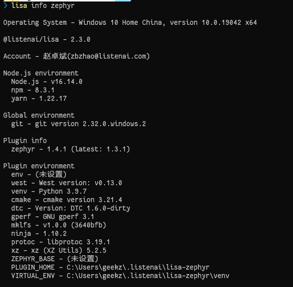

# 内置命令

本页会更详细的描述 `Lisa Zephyr` 插件的内置命令。

## use-sdk
`lisa zep use-sdk` 提供了一些 SDK 操作的功能

### 远端拉取

```bash
lisa zep use-sdk [directory] [--from-git URL#TAG] [--manifest PATH]
```
参数解析：

| 参数 | 说明 |
| ----------- | ----------- |
| directory | 目录/路径，可为绝对路径或相对路径，会生成该目录，并将 SDK 拉取并初始化到该目录 |
| --from-git URL#TAG | 指定远端仓库以及对应分支版本，用法: --from-git https://cloud.listenai.com/zephyr/zephyr.git#v1.0.0 |
| --manifest PATH | 指定提货单在远端仓库的位置，若不带该参数，默认为根目录的 west.yml。用法: `--manifest listenai/manifest.yml` |

:::info
关于提货单的信息，请阅读 Zephyr 官方文档的 [Manifests](https://zephyr-docs.listenai.com/guides/west/manifest.html) 章节进行了解

另可使用 `--default` 参数， `--from-git` 和 `--manifest` 均使用LSCloud上的SDK，并且拉取最新的 `TAG` ：
```bash
lisa zep use-sdk [directory] --default
```
`--from-git` 远程仓库为：`https://cloud.listenai.com/zephyr/zephyr.git`
`--manifest` 提货单为：`listenai/manifest.yml`
:::

此过程会在本地 创建 一个文件夹，并一步做好后续 SDK 的 初始化。

例如：

```bash
lisa zep use-sdk ./my-zephyr-sdk --default
```

1、此命令创建 `./my-zephyr-sdk/.west`，并在 `config` 文件中设置 `manifest`， `manifest.path` 为 `--from-git` 代码仓中拉下来后的目录，由于该命令带了 `--default` 参数，所以 `manifest.file` 为 `listenai/manifest.yml`

.west/config
```text
[manifest]
path = zephyr.git
file = listenai/manifest.yml
```

2、然后解析清单文件 `listenai/manifest.yml`，并更新其中指定的每个项目

3、随后会对 SDK 源码中的 `scripts/requirements.txt` 进行 install

4、在 `Lisa Plugin Zephyr` 的执行时中设置环境变量 `ZEPHYR_BASE`，作为当前设置的 SDK，完成整个 SDK 的设置操作

### 本地切换

```bash
lisa zep use-sdk [directory]
```

有些时候，开发者本地会存在多个不同的 CSK SDK，举个例子： `E:\\cloud-csk-sdk` 和 `E:\\gitlab-csk-sdk` 为两个不同代码仓初始化的 CSK SDK。

可以直接执行下列参考切换：

```bash
lisa zep use-sdk E:\cloud-csk-sdk
```

或

```bash
lisa zep use-sdk E:\gitlab-csk-sdk
```

### 查看版本分支列表

```bash
lisa zep use-sdk --list
```

直接执行该命令，会展示当前设置的 sdk 已发布的 tags 。

### 切换版本分支

```bash
lisa zep use-sdk --mr v1.0.0
```

直接执行该命令，会将当前设置的 sdk 切换到目标tag分支。

另外想要查看当前 sdk 是什么版本、分支，可执行 `lisa info zephyr` 查看 `ZEPHYR_BASE` 。

### 更新分支远端代码

```bash
lisa zep use-sdk --update
```

直接执行该命令，会对当前设置的 sdk ，对当前分支进行自动代码更新和modules更新。

:::info
通常情况下，仅在某些远端分支经常变动需要使用该命令。
如 `master` 分支，执行 `lisa info zephyr` 确保当前 ZEPHYR_BASE 的分支为 `master`, 否则需要 `--mr master` 切换到 `master` 分支，再进行更新。
:::

### 清空 SDK 配置

```bash
lisa zep use-sdk --clear
```

该命令会对当前设置好的 SDK ZEPHYR_BASE 进行解除。

:::info 
此操作只解除 `ZEPHYR_BASE` 设置，不会对 SDK 的目录进行删除。
:::

### 安装 SDK requirements

```bash
lisa zep use-sdk --install
```

该命令会对当前设置好的 CSK SDK , 重新对 `scripts/requirements.txt` 进行 install。

## use-env

`lisa zep use-env` 提供了一些对 CSK 编译环境的操作的功能。

### 设置 / 替换 编译环境

```bash
lisa zep use-env [...envs]
```

此过程会根据参数中的值，进行编译环境的内置。

目前支持的较常用的编译环境有 `csk6`、 `csk6-dsp`。

例如：

```bash
lisa zep use-env csk6
```

1、此命令会在用户目录下的文件夹 `.listenai/lisa-zephyr/package`，通过 lisa 安装所需的编译环境包。

2、缓存当前所设置的编译环境 `csk6`。

设置成功后，在执行 `lisa zep` 相关命令时，类沙盒的环境变量，均会自动按照所设置的编译环境，进行设置。

#### 设置多个编译环境

在日常开发中，可能存在需要多个编译环境的场景，比如我既需要 `csk6`，也需要 `csk6-dsp`。

此时可以执行如下命令：

```bash
lisa zep use-env csk6 csk6-dsp
```

该命令与上述流程一致，会将所需的编译环境包进行安装，并且缓存当前设置的编译环境。

### 更新/重新安装 已设置的编译环境

当前已经设置了 `csk6` 作为本机的编译环境，若 `csk6` 对应有包更新，或因为某种原因，你的编译环境出现异常。

此时可以执行如下命令，进行对已经设置的编译环境进行更新/重新安装:

```bash
lisa zep use-env --install
```

该命令会根据已设置的编译环境，重新安装。

### 清空当前编译环境

```bash
lisa zep use-sdk --clear
```

该命令会对当前设置好的编译环境进行解除。

## zep update

更新 SDK 所需要的功能模块

```bash
lisa zep update
```

## 更新

更新 `Lisa Zephyr` 插件到最新 `latest` 版本

```bash
lisa update zephyr
```

更新 `Lisa Zephyr` 插件到最新 `beta` 版本

```bash
lisa install @lisa-plugin/zephyr@beta -g
```

更新 `Lisa Zephyr` 插件到指定的版本

```bash
lisa install @lisa-plugin/zephyr@1.6.0 -g
```

## 打包lpk包

:::tip
打包出lpk包依赖于当前工程的编译产物，请确保你已经执行过 `lisa zep build` 相关的应用程序编译操作。

该功能特性仅在插件 `1.6.0` 及以上版本支持，请查看 [获取/更新](#更新) 章节进行插件的更新。
:::

```bash
lisa zep lpk
```

执行该命令，按照提示的步骤进行输入，即可输出当前项目的lpk包。


## info zephyr

查看下当前的zephyr环境

```bash
lisa info zephyr
```

**NOTE**: macOS、Linux也即将支持一体化安装包，敬请期待，这段时间辛苦你手指多运动啦~

`lisa info zephyr` 指令用于查看当前Zephyr的环境。在后续的开发上，该命令也可作为环境自检的一个方式。若在环境检测过中存在工具缺失的情况，请参照FAQ章节进行解决或联系我们。

新搭建的环境，如下图：




除 `env` 和 `ZEPHYR_BASE` 外，其余环境项均安装成功，若存在未安装的，自行执行 `lisa zep install` 重新安装。