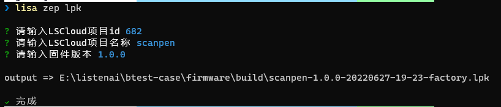

# 内置命令

本页会更详细的描述 `lisa zep` 工具的内置命令。

## lisa zep update

```bash
lisa zep update
```

默认情况下，该命令为解析工作区的提货单文件，通常为 `west.yml`，并基于该文件进行相关`模块project`的拉取或更新，作用到工作区中。

- 当你处于 `集成式应用` 下，提货单文件为根目录下的 `west.yml`，而`集成式应用`的工作区为该应用目录里的 `.sdk` 文件夹。
- 其余情况下，该命令都会对 `ZEPHYR_BASE` 进行模块的拉取或更新。`ZEPHYR_BASE` 即 `CSK SDK`，也就是工作区，可通过 `lisa info zep` 查看。

__模块project更新流程:__

针对每个`模块project`：

1.为工作区中的模块初始化本地 Git 存储库（如果从未拉取过

2.检查提货单中模块的revision字段，如果它在本地不可用，则从远程获取它

3.将项目的`manifest-rev`分支设置为上一步中修订指定的提交

4.`checks out` 该 `manifest-rev` 作为[detached HEAD](#https://git-scm.com/docs/git-checkout#_detached_head) 

5.如果提货单文件有 `import` 其他提货单，则递归更新子模块。


## 打包lpk包

:::tip
打包出lpk包依赖于当前工程的编译产物，请确保你已经执行过 `lisa zep build` 相关的应用程序编译操作。

该功能特性仅在 lisa zep 工具 `1.6.0` 及以上版本支持，请查看 [获取/更新](#更新) 章节进行工具的更新。
:::

```bash
lisa zep lpk
```

执行该命令，按照提示的步骤进行输入，即可输出当前项目的lpk包。


<<<<<<< HEAD
