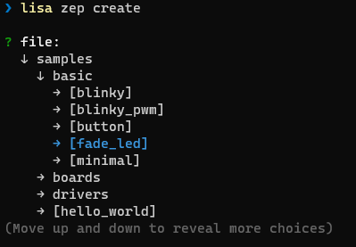

# 创建项目

通过该章节，你可以了解到 `工程项目` 的创建操作。

当你设置好你的CSK SDK后，在任意你想创建项目的目录下，执行以下命令:

```bash
lisa zep create
```




使用 `上下键` 操作，`左右键`/`空格键` 打开/关闭 文件夹， `回车键` 确认选择。

选择想要创建的sample工程后，可以修改创建的文件夹名，默认为该sample工程原来的名字。
