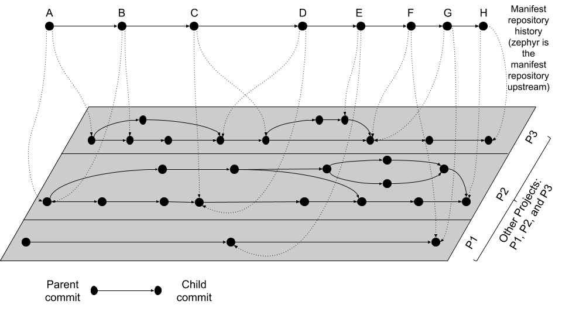

# 提货单

This page contains detailed information about west’s multiple repository model, manifest files, and the `west manifest` command. For API documentation on the `west.manifest` module, see west.manifest. For a more general introduction and command overview, see [Basics](https://docs.zephyrproject.org/latest/develop/west/basics.html#west-basics).

此页面包含有关 Lisa Zephyr 的多存储库模型、提货单文件和 `lisa zep manifest` 命令的详细信息。

## Multiple Repository Model
## 多存储库模型

West’s view of the repositories in a [west workspace](https://docs.zephyrproject.org/latest/glossary.html#term-west-workspace), and their history, looks like the following figure (though some parts of this example are specific to upstream Zephyr’s use of west):

Lisa Zephyr 对 [SDK 工作区](https://docs.zephyrproject.org/latest/glossary.html#term-west-workspace)中的存储库及其历史的总览如下图所示（尽管此示例的某些部分特定与上游 Zephyr 对 Lisa Zephyr 的使用）：



The history of the manifest repository is the line of Git commits which is “floating” on top of the gray plane. Parent commits point to child commits using solid arrows. The plane below contains the Git commit history of the repositories in the workspace, with each project repository boxed in by a rectangle. Parent/child commit relationships in each repository are also shown with solid arrows.

提货单仓库的历史是一条浮动在灰色平面上的 Git 提交。父提交指向子提交使用实线箭头。下面的平面包含了工作区中的所有项目仓库的 Git 提交历史，其中每个项目仓库都由一个矩形框架包围。在每个项目仓库中，父/子提交关系也用实线箭头显示。

The commits in the manifest repository (again, for upstream Zephyr this is the zephyr repository itself) each have a manifest file. The manifest file in each commit specifies the corresponding commits which it expects in each of the project repositories. This relationship is shown using dotted line arrows in the diagram. Each dotted line arrow points from a commit in the manifest repository to a corresponding commit in a project repository.

提货单仓库中的每个提交（同样，对于上游 Zephyr，这是 zephyr 仓库本身）都有一个提货单文件。提货单文件在每个提交中指定了对应于每个项目仓库的提交。这个关系用虚线箭头显示在图中。每个虚线箭头指向提货单仓库中的提交，并且指向项目仓库中的提交。

Notice the following important details:

- Projects can be added (like `P1` between manifest repository commits `D` and `E`) and removed (`P2` between the same manifest repository commits)

- 可以添加项目（如在提货单仓库提交 `D` 和 `E` 之间 `P1`），也可以删除项目（同一提货单仓库提交之间的 `P2`）

- Project and manifest repository histories don’t have to move forwards or backwards together:
  - `P2` stays the same from `A` → `B`, as do `P1` and `P3` from `F → G`.
  - `P3` moves forward from `A → B`
  - `P3` moves backward from `C → D`.
  
- 项目和提货单仓库历史不必顺序相邻：
  - `P2` 从 `A` 到 `B` 不变，同时 `P1` 和 `P3` 从 `F` 到 `G` 不变。
  - `P3` 自 `A → B` 向前移动
  - `P3` 自 `C → D` 向后移动
  
  One use for moving backward in project history is to “revert” a regression by going back to a revision before it was introduced.

 在项目历史中向后移动的一种用法是通过回到引入回归之前的修订来 “回滚” 回归。

- Project repository commits can be “skipped”: `P3` moves forward multiple commits in its history from `B → C`.
  
- 项目仓库提交可以被跳过：`P3` 从 `B → C` 向前移动多个提交。

- In the above diagram, no project repository has two revisions “at the same time”: every manifest file refers to exactly one commit in the projects it cares about. This can be relaxed by using a branch name as a manifest revision, at the cost of being able to bisect manifest repository history.
  
- 在上面的图中，没有项目仓库 “同时” 有两个修订：每个提货单文件都只引用一个项目中的提交。这可以通过使用分支名作为提货单修订来放宽，但代价是能够分清提货单仓库历史。

## 提货单文件

West manifests are YAML files. Manifests have a top-level `manifest` section with some subsections, like this:

提货单(manifest)是 YAML 文件。有一个顶级货单栏和一些子栏，如下所示:

```YAML
manifest:
  remotes:
    # 项目 URL 的简称
  projects:
    # 项目清单
  defaults:
    # 默认项目配置
  self:
    # 与货单存储相关的配置
    # 例如，包含 manifest.yml 的存储库
  version: "<schema-version>"
  group-filter:
    # 要启用或者禁用的项目组列表
```

In YAML terms, the manifest file contains a mapping, with a `manifest` key. Any other keys and their contents are ignored (west v0.5 also required a `west` key, but this is ignored starting with v0.6).

在 YAML 术语中，YAML 文件包含一个带有 manifest 字段。

The manifest contains subsections, like defaults, remotes, projects, and self. In YAML terms, the value of the manifest key is also a mapping, with these “subsections” as keys. As of west v0.10, all of these “subsection” keys are optional.

manifest 包含子字段，如 `default`, `remotes`, `projects`, `self`。当然，manifest 的子字段都是可选的。

The projects value is a list of repositories managed by west and associated metadata. We’ll discuss it soon, but first we will describe the remotes section, which can be used to save typing in the projects list.

这部分可以不翻译

## Remotes 

The remotes subsection contains a sequence which specifies the base URLs where projects can be fetched from.

`remotes` 指定远端项目的 URL 地址。

Each remotes element has a name and a “URL base”. These are used to form the complete Git fetch URL for each project. A project’s fetch URL can be set by appending a project-specific path onto a remote URL base. (As we’ll see below, projects can also specify their complete fetch URLs.)

每一个 `remotes` 都有一个 `name`(名称) 和 一个 `url-base` 字段，这为项目提供了完整 Git 项目的 URL 地址。

For example:

例如:

```YAML
manifest:
  # ...
  remotes:
    - name: remote1
      url-base: https://git.example.com/base1
    - name: remote2
      url-base: https://git.example.com/base2
```

The remotes keys and their usage are in the following table.

小表列出了 `remotes` 中的字段和说明。

| 字段 | 说明 |
| ---- | ------ |
| name | 必须，remote 的唯一名称   |
| url-base | 必须，远程项目的 URL 地址 |

Above, two remotes are given, with names remote1 and remote2. Their URL bases are respectively https://git.example.com/base1 and https://git.example.com/base2. You can use SSH URL bases as well; for example, you might use git@example.com:base1 if remote1 supported Git over SSH as well. Anything acceptable to Git will work.

上面示例给出两个 `remote`，分别名为 `remote1` 和 `remote2`。`url-base` 项目的地址分别是 `https://git.example.com/base1` 和 `https://git.example.com/base2`，你也可以使用 `SSH` URL 地址方式，只要是 Git 支持的格式就行。

## Projects

The projects subsection contains a sequence describing the project repositories in the west workspace. Every project has a unique name. You can specify what Git remote URLs to use when cloning and fetching the projects, what revisions to track, and where the project should be stored on the local file system.

`projects` 指定了项目的信息。每一个项目都有一个唯一(name)名称，可以指定项目 Git 远程 URL 地址，项目的修改提交 commit，以及项目应该存放在本机上的位置。

Here is an example. We’ll assume the remotes given above.

下面这个例子，我们假设上面给出 `remotes`：

```YAML
manifest:
  projects:
    - name: proj1
      remote: remote1
      path: extra/project-1
    - name: proj2
      repo-path: my-path
      remote: remote2
      revision: v1.3
    - name: proj3
      url: https://github.com/user/project-three
      revision: abcde413a111
```

上面的 YAML 文件：

- proj1 has remote remote1, so its Git fetch URL is https://git.example.com/base1/proj1. The remote url-base is appended with a / and the project name to form the URL.
  
  `proj1` 有一个 `remote` `remote1`，它的 Git 项目 URL 地址为：https://git.example.com/base1/proj1，`remote`，`remote` `url-base` 后面附加一个/和项目名来形成 URL。

  Locally, this project will be cloned at path extra/project-1 relative to the west workspace’s root directory, since it has an explicit path attribute with this value.

  在本地，这个项目会被克隆到 CSK SDK 工作空间的根目录下的 extra/project-1 目录中，`path` 字段指定了这个值。

  Since the project has no revision specified, master is used by default. The current tip of this branch will be fetched and checked out as a detached HEAD when west next updates this project.

  由于没有指定项目 commit，默认情况下使用 master 分支。当下一次更新时，项目的最新提交将作为一个分离的 HEAD 来更新。

- proj2 has a remote and a repo-path, so its fetch URL is https://git.     example.com/base2/my-path. The repo-path attribute, if present, overrides the default name when forming the fetch URL.
  
  `proj2` 有一个 `remote` 和 `repo-path` 字段，所以它的 URL 地址是： https://git.example.com/base2/my-path。如果 `repo-path` 字段存在，它会在拉取项目仓库 URL 时覆盖默认的名称。

  Since the project has no path attribute, its name is used by default. It will be cloned into a directory named proj2. The commit pointed to by the v1.3 tag will be checked out when west updates the project.

  由于项目没有 `path` 字段，因此默认情况下使用其名称，它会被克隆到一个名为 proj2 的目录中。当更新时，`revision` v1.3 的 Git tag 将会被更新到本地上。

- proj3 has an explicit url, so it will be fetched from https://github.com/user/project-three.
  
  `proj3`有一个 url 字段，更新时将会从这个 URL 中更新项目。

  Its local path defaults to its name, proj3. Commit abcde413a111 will be checked out when it is next updated.

  本地路径默认的名称为 `proj3`，下一次更新时将会从提交 abcde413a111 更新。

The available project keys and their usage are in the following table. Sometimes we’ll refer to the defaults subsection; it will be described next.

下表列出了可用 `projects` 字段和说明：

| 字段 | 说明 |
| ---- | ---- |
| name | Mandatory; a unique name for the project. The name cannot be one of the reserved values “west” or “manifest”. The name must be unique in the manifest file. 必须的，项目的唯一名称，名称不能是保留值 "west" 或 "manifest" 之一，该名称在 YAML 文件中必须是唯一的。 |
| remote, url | Mandatory (one of the two, but not both). 必须有其中一个，不需要两个都写。If the project has a remote, that remote’s url-base will be combined with the project’s name (or repo-path, if it has one) to form the fetch URL instead. 如果 `project` 有 `remote` 字段，那么 `remote's` `url-base` 字段将与 `project` 的 `name` （或者 `repo-path`， 如果有的话） 字段组合形成一个 URL |
| repo-path | Optional. If given, this is concatenated on to the remote’s url-base instead of the project’s name to form its fetch URL. Projects may not have both url and repo-path attributes. 可选，如果值不为空，那么将会跟 `remote` `url-base` 字段组合成 URL，而不是跟 `project` 中 `name`，`project` 不能同时存在 `url` 和 `repo-path` 字段 |
| revision | Optional. The Git revision that west update should check out. This will be checked out as a detached HEAD by default, to avoid conflicting with local branch names. If not given, the revision value from the defaults subsection will be used if present. 可选，SDK 更新时会从该字段拉取代码更新。默认情况下，这会创建一个新的 HEAD 分支出来以避免与本地分支造成冲突。如果该字段不填，则使用 `defaults` 中 `revision` 字段(如果存在的话)。A project revision can be a branch, tag, or SHA. `project` `revision` 可以是分支(branch)，标签(tag) 或者 SHA。The default revision is master if not otherwise specified. 如果未指定其他的值，则默认 `revision` 为 master |
| path | Optional. Relative path specifying where to clone the repository locally, relative to the top directory in the west workspace. If missing, the project’s name is used as a directory name. 可选，克隆仓库到本地 SDK 的顶层目录的相对路径。如果缺少 `project` 的 `name` 字段，则将其用作目录名称 |
| clone-path | Optional. If given, a positive integer which creates a shallow history in the cloned repository limited to the given number of commits. This can only be used if the revision is a branch or tag. 可选，如果给定，一个正整数，它在克隆的仓库中创建一个浅历史，限制为给定的提交数量。这只能在如果 `revision` 字段的值是一个分支(branch)或者标签(tag) |
| west-commands | Optional. If given, a relative path to a YAML file within the project which describes additional west commands provided by that project. This file is named west-commands.yml by convention. See Extensions for details. 如果给定，项目中 YAML 文件的相对路径，该文件描述了该项目提供的其他 west 命令。这个文件按照惯例命名为 west-commands.yml。 |
| import | Optional. If true, imports projects from manifest files in the given repository into the current manifest. See Manifest Imports for details.可选，如果为 `true` 则将项目从给定仓库中的 YAML 文件导入到当前 YAML 文件中。 |
| groups | Optional, a list of groups the project belongs to. See Project Groups and Active Projects for details. 可选，项目所属的组(group)列表 |
| submodules | Optional. You can use this to make west update also update Git submodules defined by the project. See Git Submodules in Projects for details. 可选，你可以使用 `lisa zep update` 更新代码同时更新 Git 子模块的代码 |
| userdata | Optional. The value is an arbitrary YAML value. See Repository user data. 可选，该值是任意的 YAML 值。 |

## Defaults 

The defaults subsection can provide default values for project attributes. In particular, the default remote name and revision can be specified here. Another way to write the same manifest we have been describing so far using defaults is:

`defaults` 字段可以为项目提供默认值，可以指定 `remote` 中 `name` 和 `revision`。另一种使用默认值编写相同提货单的方法是:

```YAML
manifest:
  defaults:
    remote: remote1
    revision: v1.3

  remotes:
    - name: remote1
      url-base: https://git.example.com/base1
    - name: remote2
      url-base: https://git.example.com/base2

  projects:
    - name: proj1
      path: extra/project-1
      revision: master
    - name: proj2
      repo-path: my-path
      remote: remote2
    - name: proj3
      url: https://github.com/user/project-three
      revision: abcde413a111
```

The available defaults keys and their usage are in the following table.

下表列出可用的字段和说明：

| 字段 | 说明 |
| ---- | ---- |
| remote | Optional. This will be used for a project’s remote if it does not have a url or remote key set. 可选，如果 `project` 中没有 `url` 和 `remote` 字段，那么这个字段将会默认为 `project's` 中 `remote` 字段的值 |
| revision | Optional. This will be used for a project’s revision if it does not have one set. If not given, the default is master. 可选，如果 `project` 中没有 `revision` 字段，那么这个字段会默认为 `project's` 中 `revision` 字段的值 |

## Self

The self subsection can be used to control the manifest repository itself.

`self` 字段用于控制提货单仓库本身。

As an example, let’s consider this snippet from the zephyr repository’s west.yml:

作为一个例子，让我们看一下 zephyr 仓库的 West.yml 的这个片段:

```YAML
manifest:
  # ...
  self:
    path: zephyr
    west-commands: scripts/west-commands.yml
```

This ensures that the zephyr repository is cloned into path zephyr, though as explained above that would have happened anyway if cloning from the default manifest URL, https://github.com/zephyrproject-rtos/zephyr. Since the zephyr repository does contain extension commands, its self entry declares the location of the corresponding west-commands.yml relative to the repository root.

这确保了 zephyr 仓库被克隆到路径 `zephyr` 中，self 字段声明了相应的 west-commands.yml 相对于仓库根目录的位置。

The available self keys and their usage are in the following table.

下表列出可用的字段和说明：

| 字段 | 说明 |
| ---- | ---- |
| path | Optional. The path west init should clone the manifest repository into, relative to the west workspace topdir. 可选，克隆项目到相对于 SDK 顶层目录的相对路径 If not given, the basename of the path component in the manifest repository URL will be used by default. For example, if the URL is https://git.example.com/project-repo, the manifest repository would be cloned to the directory project-repo. 如果未指定值，则默认情况下将使用提货单仓库 URL 中的路径组件的基名。例如，如果 URL 是 https://git.example.com/project-repo，则仓库将被克隆到目录 project-repo |
| west-commands | Optional. This is analogous to the same key in a project sequence element. 可选，跟 `project` 中 `west-commands` 字段意思一样 |
| import | Optional. This is also analogous to the projects key, but allows importing projects from other files in the manifest repository. See Manifest Imports. 可选，跟 `project` 中 `west-commands` 字段意思一样，但是允许从提货单仓库中其他文件导入项目 |

## Project Groups 与 Active Projects
## 项目组与活跃的项目

You can use the `groups` and `group-filter` keys briefly described above to place projects into groups, and filter which groups are enabled. These keys appear in the manifest like this:

你可以使用 `groups` 和 `group-filter` 字段将 [提货单文件](#提货单文件) 项目分组，并过滤哪些组是启用的。这些字段在提货单文件中描述如下:

```YAML
manifest:
  projects:
    - name: some-project
      groups: ...
  group-filter: ...
```

You can enable or disable project groups using `group-filter`. Projects whose groups are all disabled are inactive; west essentially ignores inactive projects unless explicitly requested not to.

你可以使用和 `group-filter` 字段来启用或禁用项目组(即 `projects` 中的 `groups`)。所有 `groups` 都被禁用的 `project` 是不可用的，Lisa Zephyr 会忽略这些项目，除非你要求不要忽略它们。

The next section introduces project groups; the following sections describe Enabled and Disabled Project Groups and Active and Inactive Projects. There are some basic examples in Project Group Examples.

下一章介绍 (project groups) 项目组；下面的章节介绍[启用和禁用的项目组](#启用和禁用项目组)和[可用和不可用的项目](#可用和不可用项目)。并且会附带上讲解的例子。

Finally, Group Filters and Imports provides a simplified overview of how group-filter interacts with the Manifest Imports feature.

最后，[组过滤和导入](#组过滤和导入) 简单概述了如何与 [导入提货单](#导入提货单) 功能交互。

### Project Groups

Inside `manifest: projects:`, you can add a project to one or more groups. The `groups` key is a list of group names. Group names are strings.

你可以在 `manifest: projects:` 中添加一个项目到一个或多个组。`groups` 字段是一个组名列表，组名是字符串。

For example, in this manifest fragment:

例如，在这个提货单片段中：

```YAML
manifest:
  projects:
    - name: project-1
      groups:
        - groupA
    - name: project-2
      groups:
        - groupB
        - groupC
    - name: project-3
```

The projects are in these groups:

- `project-1`: one group, named `groupA`
- `project-2`: two groups, named `groupB` and `groupC`
- `project-3`: no groups

在这些组的项目中：
- `project-1`：一个组，名为 `groupA`
- `project-2`：两个组，名为 `groupB` 和 `groupC`
- `project-3`：没有组

Project group names must not contain commas (,), colons (:), or whitespace.

项目组名不能包含逗号 (,)、冒号 (:) 或空格。

Group names must not begin with a dash (-) or the plus sign (+), but they may contain these characters elsewhere in their names. For example, `foo-bar` and `foo+bar` are valid groups, but -foobar and +foobar are not.

组名不能以减号 (-) 或加号 (+) 开头，但是它们可以在名称内包含这些字符。例如，`foo-bar` 和 `foo+bar` 是有效的组，但是 `-foobar` 和 `+foobar` 不是。

Group names are otherwise arbitrary strings. Group names are case sensitive.

组名是任意字符串，组名是大小写敏感的。

As a restriction, no project may use both `import:` and `groups:`. (This avoids some edge cases whose semantics are difficult to specify.)

任何项目不能同时使用 `import:` 和 `groups:` (这避免了一些语义难以指定的边界情况)。

### Enabled and Disabled Project Groups
### 启用和禁用项目组

All project groups are enabled by default. You can enable or disable groups in both your manifest file and [Configuration](https://docs.zephyrproject.org/latest/develop/west/config.html#west-config).

默认情况下启用所有的项目组，你可以在 minifest 文件启用或禁用组。

Within a manifest file, `manifest: group-filter:` is a YAML list of groups to enable and disable.

在 minifest 文件中，`manifest: group-filter:` 是一个 YAML 列表，用于启用和禁用组。

To enable a group, prefix its name with a plus sign (+). For example, `groupA` is enabled in this manifest fragment:

要启用组，请在其名称前加上加号 (+)。例如，启用 `groupA` 的例子：

```YAML
manifest:
  group-filter: [+groupA]
```

Although this is redundant for groups that are already enabled by default, it can be used to override settings in an imported manifest file. See [Group Filters and Imports] for more information.

尽管对于默认启用的组来说是多余的，但是它可以用来覆盖导入的提货单文件中的设置。请参见 [Group Filters 和 Import](#组过滤和导入)。

To disable a group, prefix its name with a dash (-). For example, groupA and groupB are disabled in this manifest fragment:

要禁用组，请在其名称前加上减号 (-)。例如，禁用 `groupA` 和 `groupB` 的例子：

```YAML
manifest:
  group-filter: [-groupA,-groupB]
```

:::inf
Since `group-filter` is a YAML list, you could have written this fragment as follows:

```YAML
manifest:
  group-filter:
    - -groupA
    - -groupB
```

However, this syntax is harder to read and therefore discouraged.

因为 `group-filter` 是一个 YAML 列表，所以你可以写成这样：

```YAML
manifest:
  group-filter:
    - -groupA
    - -groupB
```

但是，这种语法显得更难读不易于理解，所以不建议使用。
:::

In addition to the manifest file, you can control which groups are enabled and disabled using the `manifest.group-filter` configuration option. This option is a comma-separated list of groups to enable and/or disable.

除了提货单文件外，你可以使用 `manifest.group-filter` 配置选项来决定哪些组启用或者禁用。这个选项是一个用逗号分隔的组列表，用于启用或禁用组。

```bash

To enable a group, add its name to the list prefixed with +. To disable a group, add its name prefixed with -. For example, setting `manifest.group-filter` to `+groupA`,`-groupB` enables `groupA`, and disables `groupB`.

要启用一个组，请将其名称添加到列表前缀为 + 列表中。要禁用一个组，请将其名称添加到列表前缀为 - 列表中。例如，设置 `manifest.group-filter` 为 `+groupA`,`-groupB` 启用 `groupA`，禁用 `groupB`。

The value of the configuration option overrides any data in the manifest file. You can think of this as if the `manifest.group-filter` configuration option is appended to the `manifest: group-filter:` list from YAML, with “last entry wins” semantics.

配置选项的值会覆盖提货单文件中任何数据。你可以将其看作是将 `manifest.group-filter` 配置选项添加到 YAML 的 `manifest: group-filter:` 列表中，并且有着 "最后一个获胜" 的语义。

### Active and Inactive Projects
### 可用和不可用项目

All projects are active by default. Projects with no groups are always active. A project is inactive if all of its groups are disabled. This is the only way to make a project inactive.

默认情况下，所有的项目都是可用状态。没有组(groups)的项目(projects)也始终处于可用状态。如果所有的组都被禁用，那么项目就处于不可用状态。这是禁用项目的唯一方式。

Most west commands that operate on projects will ignore inactive projects by default. For example, west update when run without arguments will not update inactive projects. As another example, running `west list` without arguments will not print information for inactive projects.

默认情况下，大多数对项目操作的 Lisa Zephyr 命令将忽略不可用的项目。例如，当运行不带参数的 `lisa zep update` 命令时不会更新不可用的项目。另一个例子是，运行 `lisa zep list` 命令时不会打印不可用的项目的信息。

### Project Group Examples
### 项目组示例

This section contains example situations involving project groups and active projects. The examples use both `manifest: group-filter:` YAML lists and `manifest.group-filter` configuration lists, to show how they work together.

本节包含项目组和可用项目的示例，示例使用 `manifest: group-filter:` YAML 列表和 `manifest.group-filter` 配置列表来演示如何一起工作。

Note that the `defaults` and `remotes` data in the following manifests isn’t relevant except to make the examples complete and self-contained.

请注意，以下提货单中的 `defaults` 和 `remotes` 的数据不是有关联的，只是为了使示例完整且独立。

#### Example 1: no disabled groups
#### 示例 1：没有禁用的组

The entire manifest file is:

整个提货单文件如下：

```YAML
manifest:
  projects:
    - name: foo
      groups:
        - groupA
    - name: bar
      groups:
        - groupA
        - groupB
    - name: baz

  defaults:
    remote: example-remote
  remotes:
    - name: example-remote
      url-base: https://git.example.com
```

The `manifest.group-filter` configuration option is not set (you can ensure this by running `west config -D manifest.group-filter`).

`manifest.group-filter` 配置选项没有设置（你可以通过运行 `lisa zep config -D manifest.group-filter` 来确保这一点）。

No groups are disabled, because all groups are enabled by default. Therefore, all three projects (`foo`, `bar`, and `baz`) are active. Note that there is no way to make project `baz` inactive, since it has no groups.

没有组被禁用，因为所有组都是默认可用的。因此，三个项目（`foo`, `bar`, 和 `baz`）都是可用的。请注意，没有办法禁用项目 `baz`，因为它没有组。

#### Example 2: Disabling one group via manifest
#### 示例 2：通过提货单禁用一个组

The manifest file is:

整个提货单文件如下：

```YAML
manifest:
  projects:
    - name: foo
      groups:
        - groupA
    - name: bar
      groups:
        - groupA
        - groupB

  group-filter: [-groupA]

  defaults:
    remote: example-remote
  remotes:
    - name: example-remote
      url-base: https://git.example.com
```

The `manifest.group-filter` configuration option is not set (you can ensure this by running `west config -D manifest.group-filter`).

`manifest.group-filter` 配置选项没有设置（你可以通过运行 `lisa zep config -D manifest.group-filter` 来确保这一点）。

Since `groupA` is disabled, project `foo` is inactive. Project `bar` is active, because `groupB` is enabled.

由于 `groupA` 已禁用，项目 `foo` 是不可用的。项目 `bar` 是可用的，因为 `groupB` 已启用。

#### Example 3: Disabling multiple groups via manifest
#### 示例 3：通过提货单 禁用多个组

The manifest file is:

整个提货单文件如下：

```YAML
manifest:
  projects:
    - name: foo
      groups:
        - groupA
    - name: bar
      groups:
        - groupA
        - groupB

  group-filter: [-groupA,-groupB]

  defaults:
    remote: example-remote
  remotes:
    - name: example-remote
      url-base: https://git.example.com
```

The `manifest.group-filter` configuration option is not set (you can ensure this by running `west config -D manifest.group-filter`).

`manifest.group-filter` 配置选项没有设置（你可以通过运行 `lisa zep config -D manifest.group-filter` 来确保这一点）。

Both `foo` and `bar` are inactive, because all of their groups are disabled.

`foo` 和 `bar` 都是不可用的，因为它们的所有组都被禁用了。

#### Example 4: Disabling a group via configuration
#### 示例 4：通过配置禁用一个组

The entire manifest file is:

整个提货单文件如下：

```YAML
manifest:
  projects:
    - name: foo
      groups:
        - groupA
    - name: bar
      groups:
        - groupA
        - groupB

  defaults:
    remote: example-remote
  remotes:
    - name: example-remote
      url-base: https://git.example.com
```

The `manifest.group-filter` configuration option is set to `-groupA` (you can ensure this by running `west config manifest.group-filter -- -groupA`; the extra `--` is required so the argument parser does not treat `-groupA` as a command line option `-g` with value `roupA`).

`manifest.group-filter` 配置项设置为 `-groupA` (你可以通过运行 `lisa zep config manifest.group-filter -- -groupA` 来确保这一点；额外的 `--` 是必要的，因为命令行参数解析器不会认为 `-groupA` 为命令行选项 `-g` 且值为 `roupA`);

Project `foo` is inactive because `groupA` has been disabled by the `manifest.group-filter` configuration option. Project `bar` is active because `groupB` is enabled.

项目 `foo` 是不可用的，因为 `groupA` 已被 `manifest.group-filter` 配置项禁用了。项目 `bar` 是可用的，因为 `groupB` 已启用。

#### Example 5: Overriding a disabled group via configuration
#### 示例 5：通过配置覆盖禁用的组

The entire manifest file is:

整个提货单文件如下：

```YAML
manifest:
  projects:
    - name: foo
    - name: bar
      groups:
        - groupA
    - name: baz
      groups:
        - groupA
        - groupB

  group-filter: [-groupA]

  defaults:
    remote: example-remote
  remotes:
    - name: example-remote
      url-base: https://git.example.com
```

The  `manifest.group-filter` configuration option is set to `+groupA` (you can ensure this by running `west config manifest.group-filter +groupA`).

`manifest.group-filter` 配置项设置为 +groupA (你可以通过运行 `lisa zep config manifest.group-filter +groupA` 来确保这一点);

In this case, `groupA` is enabled: the `manifest.group-filter` configuration option has higher precedence than the `manifest: group-filter:` `[-groupA]` content in the manifest file.

在这种情况下，`groupA` 已启用：`manifest.group-filter` 配置项的优先级高于提货单文件中的 `manifest: group-filter:` `[-groupA]`。

Therefore, projects foo and bar are both active.

因此，项目 `foo` 和 `bar` 都是可用的。

#### Example 6: Overriding multiple disabled groups via configuration
#### 示例 6：通过配置覆盖多个禁用的组

The entire manifest file is:

整个提货单文件如下：

```YAML
manifest:
  projects:
    - name: foo
    - name: bar
      groups:
        - groupA
    - name: baz
      groups:
        - groupA
        - groupB

  group-filter: [-groupA,-groupB]

  defaults:
    remote: example-remote
  remotes:
    - name: example-remote
      url-base: https://git.example.com
```

The `manifest.group-filter` configuration option is set to `+groupA,+groupB` (you can ensure this by running `west config manifest.group-filter "+groupA,+groupB"`).

`manifest.group-filter` 配置项设置为 +groupA,+groupB (你可以通过运行 `lisa zep config manifest.group-filter "+groupA,+groupB"` 来确保这一点)

In this case, both `groupA` and `groupB` are enabled, because the configuration value overrides the manifest file for both groups.

在这种情况下，`groupA` 和 `groupB` 都已启用，因为配置值覆盖了提货单文件中两个组的内容。

Therefore, projects `foo` and `bar` are both active.

因此，项目 `foo` 和 `bar` 都是可用的。

#### Example 7: Disabling multiple groups via configuration
#### 示例 7：通过配置禁用多个组

The entire manifest file is:

整个提货单文件如下：

```YAML
manifest:
  projects:
    - name: foo
    - name: bar
      groups:
        - groupA
    - name: baz
      groups:
        - groupA
        - groupB

  defaults:
    remote: example-remote
  remotes:
    - name: example-remote
      url-base: https://git.example.com
```

The `manifest.group-filter` configuration option is set to `-groupA,-groupB` (you can ensure this by running `west config manifest.group-filter -- "-groupA,-groupB"`).

`manifest.group-filter` 配置项设置为 `-groupA,-groupB` (你可以通过运行 `lisa zep config manifest.group-filter -- "-groupA,-groupB"` 来确保这一点)

In this case, both `groupA` and `groupB` are disabled.

这种情况下，`groupA` 和 `groupB` 已禁用。

Therefore, projects `foo` and `bar` are both inactive.

因此，项目 `foo` 和 `bar` 都是不可用的。

### Group Filters and Imports
### 组过滤和导入

This section provides a simplified description of how the `manifest: group-filter:` value behaves when combined with [Manifest Imports. For complete details, see [Manifest Import Details].

本节简单介绍 `manifest: group-filter` 的值结合 [Manifest Imports] 的原理。有关更详细的信息，请参阅 [提货单导入详情](#提货单导入详情)。

In short:

- if you only import one manifest, any groups it disables in its `group-filter` are also disabled in your manifest
- you can override this in your manifest file’s `manifest: group-filter:` value, your workspace’s `manifest.group-filter` configuration option, or both

简而言之：

- 如果你只导入一个提货单，`group-filter` 中禁用的组也会在你的提货单中禁用
- 你可以覆盖提货单文件中的 `manifest: group-filter:` 值，SDK 中的 `manifest.group-filter` 配置项，或者两者都覆盖。

Here are some examples.

这里有些例子。

#### Example 1: no overrides
#### 示例 1：无覆盖

You are using this `parent/west.yml` manifest:

你正在使用这个 `parent/west.yml` 提货单：

```YAML
# parent/west.yml:
manifest:
  projects:
    - name: child
      url: https://git.example.com/child
      import: true
    - name: project-1
      url: https://git.example.com/project-1
      groups:
        - unstable
```

And `child/west.yml` contains:

`child/west.yml` 如下：

```YAML
# child/west.yml:
manifest:
  group-filter: [-unstable]
  projects:
    - name: project-2
      url: https://git.example.com/project-2
    - name: project-3
      url: https://git.example.com/project-3
      groups:
        - unstable
```

Only `child` and `project-2` are active in the resolved manifest.

只有 `child` 和 `project-2` 在已解析的提货单中是可用的。

The unstable group is disabled in `child/west.yml`, and that is not overridden in `parent/west.yml`. Therefore, the final `group-filter` for the resolved manifest is `[-unstable]`.

在 `child/west.yml` 中，组 `unstable` 已禁用，而这个组没有被 `parent/west.yml` 覆盖。因此，已解析的提货单的 `group-filter` 值是 `[-unstable]`。

Since `project-1` and `project-3` are in the `unstable` group and are not in any other group, they are inactive.

由于项目 `project-1` 和 `project-3` 在组 `unstable` 中，并且没有在任何其他组中，因此它们是不可用的。

#### Example 2: overriding an imported group-filter via manifest
#### 示例 2：通过 manifest 覆盖导入的 group-filter

You are using this `parent/west.yml` manifest:

你正在使用这个 `parent/west.yml` 提货单：

```YAML
# parent/west.yml:
manifest:
  group-filter: [+unstable,-optional]
  projects:
    - name: child
      url: https://git.example.com/child
      import: true
    - name: project-1
      url: https://git.example.com/project-1
      groups:
        - unstable
```

And `child/west.yml` contains:

`child/west.yml` 如下：

```YAML
# child/west.yml:
manifest:
  group-filter: [-unstable]
  projects:
    - name: project-2
      url: https://git.example.com/project-2
      groups:
        - optional
    - name: project-3
      url: https://git.example.com/project-3
      groups:
        - unstable
```

Only the `child`, `project-1`, and `project-3` projects are active.

只有 `child`, `project-1` 和 `project-3` 项目是可用的。

The `[-unstable]` group filter in `child/west.yml` is overridden in `parent/west.yml`, so the unstable group is enabled. Since `project-1` and `project-3` are in the `unstable` group, they are active.

`child/west.yml` 中的 `[-unstable]` group filter 被 `parent/west.yml` 覆盖，因此组 `unstable` 处于可用状态。由于项目 `project-1` 和 `project-3` 在组 `unstable` 中，因此它们也是可用的。

The same `parent/west.yml` file disables the `optional` group, so `project-2` is inactive.

同一个 `parent/west.yml` 文件禁用了组 `optional`，因此项目 `project-2` 是不可用的。

The final group filter specified by `parent/west.yml` is `[+unstable,-optional]`.

`parent/west.yml` 中指定的 `group-filter` 值是 `[+unstable,-optional]`。

#### Example 3: overriding an imported group-filter via configuration
#### 示例 3：通过配置覆盖导入的 group-filter

You are using this `parent/west.yml` manifest:

你正在使用这个 `parent/west.yml` 提货单：

```YAML
# parent/west.yml:
manifest:
  projects:
    - name: child
      url: https://git.example.com/child
      import: true
    - name: project-1
      url: https://git.example.com/project-1
      groups:
        - unstable
```

`child/west.yml` 如下：

```YAML
# child/west.yml:
manifest:
  group-filter: [-unstable]
  projects:
    - name: project-2
      url: https://git.example.com/project-2
      groups:
        - optional
    - name: project-3
      url: https://git.example.com/project-3
      groups:
        - unstable
```

If you run:

如果你运行：

```bash
lisa zep config manifest.group-filter +unstable,-optional
```

Then only the child, project-1, and project-3 projects are active.

那么只有 `child`、`project-1` 和 `project-3` 项目是可用的。

The `-unstable` group filter in `child/west.yml` is overridden in the `manifest.group-filter` configuration option, so the `unstable` group is enabled. Since `project-1` and `project-3` are in the `unstable` group, they are active.

`child/west.yml` 中的 `-unstable` group filter 在 `manifest.group-filter` 配置选项被覆盖，因此 `unstable` 组处于可用状态。由于项目 `project-1` 和 `project-3` 在 `unstable` 组中，所以它们也是可用的。

The same configuration option disables the `optional` group, so `project-2` is inactive.

相同的配置项禁用了 `optional` 组，所以 `project-2` 是不可用的。

The final group filter specified by `parent/west.yml` and the `manifest.group-filter` configuration option is `[+unstable,-optional]`.

最后一个 group filter 由 `parent/west.yml` 指定，然后，`manifest.group-filter` 配置项的值是 `[+unstable,-optional]`。


## Git Submodules in Projects
## Projects 的 Git子模块

You can use the submodules keys briefly described [above] to force `west update` to also handle any [Git submodules](https://git-scm.com/book/en/v2/Git-Tools-Submodules) configured in project’s git repository. The submodules key can appear inside projects, like this:

你可以使用上面描述的简短的 submodules 字段来强制 `lisa zep update` 处理项目的 git 仓库中配置的任何 [Git 子模块](https://git-scm.com/book/en/v2/Git-Tools-Submodules)。submodules 字段可以放到 projects 字段中，如下所示：

```YAML
manifest:
  projects:
    - name: some-project
      submodules: ...
```

The `submodules` key can be a boolean or a list of mappings. We’ll describe these in order.

`submodules` 字段可以是布尔值或者是映射(mappings)列表。我们将按顺序描述这些。

### Option 1: Boolean
### 选项 1：布尔值

This is the easiest way to use `submodules`.

这是使用 `submodules` 最简单的方式。

If `submodules` is `true` as a `projects` attribute, `west update` will recursively update the project’s Git submodules whenever it updates the project itself. If it’s `false` or missing, it has no effect.

如果 `submodules` 字段是 `true`，那么 `lisa zep update` 将会在更新项目时递归更新项目的子模块。如果 `submodules` 是 `false` 或者不填，那么它没有任何效果。

For example, let’s say you have a source code repository `foo`, which has some submodules, and you want `west update` to keep all of them them in sync, along with another project named `bar` in the same workspace.

例如，假如你有一个 `foo` 源码仓库，它有一些子模块，并且你想要 `lisa zep update` 保持所有子模块同步，以及在同一个工作区中另一个名为 `bar` 的项目。

You can do that with this manifest file:

你可以用这个提货单文件来做此操作：

```YAML
manifest:
  projects:
    - name: foo
      submodules: true
    - name: bar
```

Here, `west update` will initialize and update all submodules in `foo`. If bar has any submodules, they are ignored, because `bar` does not have a submodules value.

在这里，`lisa zep update` 将会初始化并更新 `foo` 中的所有子模块。如果 `bar` 项目有子模块，那么它们将被忽略，因为 `bar` 中没有声明 submodules 字段。

### Option 2: List of mappings
### 选项 2：映射列表

The `submodules` key may be a list of mappings, one list element for each desired submodule. Each submodule listed is updated recursively. You can still track and update unlisted submodules with `git` commands manually; present or not they will be completely ignored by `west`.

`submodules` 字段也可能是映射列表，每个映射都是一个子模块的配置。每个子模块都会被递归更新。你可以用 `git` 命令手动追踪和更新未列出的子模块；无论是否存在，它们都会被 `lisa` 忽略。

The `path` key must match exactly the path of one submodule relative to its parent west project, as shown in the output of `git submodule status`. The `name` key is optional and not used by west for now; it’s not passed to `git submodule` commands either. The `name` key was briefly mandatory in west version 0.9.0, but was made optional in 0.9.1.

`path` 字段必须与子模块相对于其父项目的路径完全匹配，如 `git submodule status` 的打印结果。`name` 字段是可选的，但是目前暂时不会用到。

For example, let’s say you have a source code repository `foo`, which has many submodules, and you want `west update` to keep some but not all of them in sync, along with another project named `bar` in the same workspace.

例如，假如你有一个 `foo` 源码仓库，它有很多子模块，并且你想要 `lisa zep update` 保持其中一些子模块同步，以及在同一个工作区中另一个名为 `bar` 的项目。

You can do that with this manifest file:

你可以用这个提货单文件来做此操作：

```YAML
manifest:
  projects:
    - name: foo
      submodules:
        - path: path/to/foo-first-sub
        - name: foo-second-sub
          path: path/to/foo-second-sub
    - name: bar
```

Here, `west update` will recursively initialize and update just the submodules in foo with paths `path/to/foo-first-sub` and `path/to/foo-second-sub`. Any submodules in bar are still ignored.

在这里，`lisa zep update` 将会递归初始化并只更新 `foo` 中的子模块 `path/to/foo-first-sub` 和 `path/to/foo-second-sub`。`bar` 中的子模块会被忽略。

### Manifest Imports
### 导入提货单

You can use the `import` key briefly described above to include projects from other manifest files in your `west.yml`. This key can be either a project or self section attribute:

你可以是用上面简要描述的 `import` 字段将其他提货单文件中的项目导入进你的 `west.yml` 中。这个字段可以是一个项目或者自身部分的属性：

```YAML
manifest:
  projects:
    - name: some-project
      import: ...
  self:
    import: ...
```
You can use a "self: import:"" to load additional files from the repository containing your `west.yml`. You can use a "project: … import:" to load additional files defined in that project’s Git history.

你可以使用 "self: import:" 从包含你 `west.yml` 的源码仓库中加载额外的文件。你可以使用 "project: … import:" 来加载该项目的 Git 历史中定义的文件。

West resolves the final manifest from individual manifest files in this order:

- imported files in `self`
- your `west.yml` file
- imported files in `projects`

`Lisa` 按以下顺序从各个提货单文件中解析最终提货单：

- 在 `self` 字段中导入文件
- 你的 `west.yml` 文件
- 在 `projects` 字段中导入文件

During resolution, west ignores projects which have already been defined in other files. For example, a project named `foo` in your `west.yml` makes west ignore other projects named `foo` imported from your projects list.

在处理的构成中，Lisa 会忽略已在其他文件中定义的项目。例如，`west.yml` 中名为 `foo` 的项目使 Lisa 忽略从项目列表中导入的其他名为 foo 的项目。

The import key can be a boolean, path, mapping, or sequence. We’ll describe these in order, using examples:

- Boolean
    - Example 1.1: Downstream of a Zephyr release
    - Example 1.2: “Rolling release” Zephyr downstream
    - Example 1.3: Downstream of a Zephyr release, with module fork
- Relative path
    - Example 2.1: Downstream of a Zephyr release with explicit path
    - Example 2.2: Downstream with directory of manifest files
    - Example 2.3: Continuous Integration overrides
- Mapping with additional configuration
    - Example 3.1: Downstream with name allowlist
    - Example 3.2: Downstream with path allowlist
    - Example 3.3: Downstream with path blocklist
    - Example 3.4: Import into a subdirectory
- Sequence of paths and mappings
    - Example 4.1: Downstream with sequence of manifest files
    - Example 4.2: Import order illustration

A more [formal description] of how this works is last, after the examples.

`import` 字段可以是布尔值、路径、映射或者序列。我们将用示例按顺序来描述这些内容：

- Boolean
  - 示例 1.1: Zephyr 版本下游
  - 示例 1.2: “滚动发布” Zephyr 下游
  - 示例 1.3: Zephyr 版本下游和 fork 模块
- 相对路径
  - 示例 2.1: 带明确路径的 Zephyr 下游
  - 示例 2.2: 提货单文件目录的下游
  - 示例 2.3: 持续集成重写
- 映射，其中可以添加额外的配置:
    - 示例 3.1： name allowlist 的下游
    - 示例 3.2： path allowlist 的下游
    - 示例 3.3： path blocklist 的下游
    - 示例 3.4： 导入到一个子目录
- 序列路径和映射:
    - 示例 4.1： 提货单文件序列的下游
    - 示例 4.2： 导入顺序的说明

#### Troubleshooting Note  
#### 疑难笔记

If you’re using this feature and find west’s behavior confusing, try [resolving your manifest] to see the final results after imports are done.

如果你使用此功能并发现 Lisa 的行为令人困惑，请尝试 [解析你的提货单](#解析提货单) 查看导入后的最终结果。

#### Option 1: Boolean
#### 选项1：布尔值

This is the easiest way to use `import`.

这是使用 `import` 的简单方式。

If `import` is `true` as a `projects` attribute, west imports projects from the `west.yml` file in that project’s root directory. If it’s `false` or missing, it has no effect. For example, this manifest would import `west.yml` from the `p1` git repository at revision `v1.0`:

如果 `projects` 字段中 `import` 为 `true`，则 Lisa 从 `p1` 仓库的根目录中导入 `west.yml` 文件，如果 `import` 为 `false` 或不填，则没有任何效果。例如，这个 manifest 将从 `p1` git 仓库的 `v1.0` tag 中导入 `west.yml` 文件：

```YAML
manifest:
  # ...
  projects:
    - name: p1
      revision: v1.0
      import: true    # Import west.yml from p1's v1.0 git tag
    - name: p2
      import: false   # Nothing is imported from p2.
    - name: p3        # Nothing is imported from p3 either.
```

It’s an error to set `import` to either `true` or `false` inside `self`, like this:

在 `self` 字段中设置 `import` 为 `true` 或者 `false` 是错误的，如下所示：

```YAML
manifest:
  # ...
  self:
    import: true  # Error
```

#### Example 1.1: Downstream of a Zephyr release
#### 示例 1.1：Zephyr 版本的下游

You have a source code repository you want to use with Zephyr v1.14.1 LTS. You want to maintain the whole thing using west. You don’t want to modify any of the mainline repositories.

你有一个源码仓库想用 Zephyr v1.14.1 LTS 版本。你想通过 Lisa Zephyr 来维护代码，并且你不想去修改任何主线上的代码。

In other words, the west workspace you want looks like this:

也就是说，你想要的代码目录结构是这样的：

```
my-downstream/
├── .west/                     # west 目录
├── zephyr/                    # 主线 Zephyr
│   └── west.yml               # 导入该文件的 v1.14.1 版本 
├── modules/                   # 主线 Zephyr 的模块
│   ├── hal/
│   └── [...other directories..]
├── [ ... other projects ...]  # 其他主线仓库
└── my-repo/                   # 你的下游仓库
    ├── west.yml               
    └── [...other files..]
```

You can do this with the following `my-repo/west.yml`:

你可以通过下面 `my-repo/west.yml` 来做这些操作：

```YAML
# my-repo/west.yml:
manifest:
  remotes:
    - name: zephyrproject-rtos
      url-base: https://github.com/zephyrproject-rtos
  projects:
    - name: zephyr
      remote: zephyrproject-rtos
      revision: v1.14.1
      import: true
```

You can then create the workspace on your computer like this, assuming `my-repo` is hosted at `https://git.example.com/my-repo`:

然后你可以像这样在你的电脑上创建项目，假设 `my-repo` 托管在 `https://git.example.com/my-repo`：

```bash
lisa zep init -m https://git.example.com/my-repo my-downstream
cd my-downstream
lisa zep update
```

After `west init`, `my-downstream/my-repo` will be cloned.

`lisa zep init` 后，`my-downstream/my-repo` 将会被克隆下来。

After `west update`, all of the projects defined in the `zephyr` repository’s `west.yml` at revision `v1.14.1` will be cloned into `my-downstream` as well.

`lisa zep update`， 在 `zephyr` 仓库的 `West.yml` 修订版 `v1.14.1` 中定义的所有项目也将被克隆到 `my-downstream` 中。

You can add and commit any code to `my-repo` you please at this point, including your own Zephyr applications, drivers, etc. See [Application Development](https://docs.zephyrproject.org/latest/develop/application/index.html#application).

在这种情况下，你可以添加和提交任何代码到 `my-repo`，包括你自己 Zephyr 应用，驱动程序等等，参考[应用开发](https://docs.zephyrproject.org/latest/develop/application/index.html#application)。

#### Example 1.2: “Rolling release” Zephyr downstream
#### 示例 1.2：“滚动发布” Zephyr 下游

This is similar to [Example 1.1: Downstream of a Zephyr release](https://docs.zephyrproject.org/latest/develop/west/manifest.html#west-manifest-ex1-1), except we’ll use `revision: main` for the zephyr repository:

这类似于[示例 1.1：Zephyr 版本的下游](#示例-11zephyr-版本的下游)，只不过 zephyr 仓库将使用 `revision: main`：

```
# my-repo/west.yml:
manifest:
  remotes:
    - name: zephyrproject-rtos
      url-base: https://github.com/zephyrproject-rtos
  projects:
    - name: zephyr
      remote: zephyrproject-rtos
      revision: main
      import: true
```

You can create the workspace in the same way:

你可以以同样的方式创建项目：

```bash
west init -m https://git.example.com/my-repo my-downstream
cd my-downstream
west update
```

This time, whenever you run `west update`, the special [manifest-rev](https://docs.zephyrproject.org/latest/develop/west/workspaces.html#west-manifest-rev) branch in the `zephyr` repository will be updated to point at a newly fetched main branch tip from the URL https://github.com/zephyrproject-rtos/zephyr.

这时候，无论何时运行 `lisa zep update`，`zephyr` 仓库中的特殊 [manifest-rev](https://docs.zephyrproject.org/latest/develop/west/workspaces.html#west-manifest-rev) 分支将呗更新为指向 URL https://github.com/zephyrproject-rtos/zephyr `main` 的分支。

The contents of `zephyr/west.yml` at the new `manifest-rev` will then be used to import projects from Zephyr. This lets you stay up to date with the latest changes in the Zephyr project. The cost is that running `west update` will not produce reproducible results, since the remote `main` branch can change every time you run it.

然后，`manifest-rev` 中的 `zephyr/west.yml` 的内容将从 Zephyr 导入项目。这让你可以及时了解 Zephyr 项目的最新变化。代价是运行 `lisa zep update` 不会产生可重现的结果，因为每次运行它远程主分支都会发生变化。

It’s also important to understand that west **ignores your working tree’s** `zephyr/west.yml` entirely when resolving imports. West always uses the contents of imported manifests as they were committed to the latest `manifest-rev` when importing from a project.

同样重要的是要理解，在解析导入时 Lisa Zephyr 会**忽略工作树**的 `zephyr/west.yml`。Lisa Zephyr 始终使用导入的 manifests 的内容，因为它们从导入时已提交到最新的 `manifest-rev`。

You can only import manifest from the file system if they are in your manifest repository’s working tree. See Example 2.2: Downstream with directory of manifest files for an example.

你只能在 manifest 仓库工作树中才能从文件系统导入 manifest。参见 [Example 2.2: Downstream with directory of manifest files](https://docs.zephyrproject.org/latest/develop/west/manifest.html#west-manifest-ex2-2)。

#### Example 1.3: Downstream of a Zephyr release, with module fork
#### 示例 1.3：Zephyr 版本下游和 fork 模块

This manifest is similar to the one in [Example 1.1: Downstream of a Zephyr release](https://docs.zephyrproject.org/latest/develop/west/manifest.html#west-manifest-ex1-1), except it:

这 manifest 类似于[示例 1.1：Zephyr 版本的下游](#示例-11zephyr-版本的下游)，除了：

- is a downstream of Zephyr 2.0
- includes a downstream fork of the `modules/hal/nordic` [module](https://docs.zephyrproject.org/latest/develop/modules.html#modules) which was included in that release
  
- 是 zephyr 2.0 的下游
- 包括该版本中包含的 `modules/hal/nordic` 模块的下游分支

```YAML
# my-repo/west.yml:
manifest:
  remotes:
    - name: zephyrproject-rtos
      url-base: https://github.com/zephyrproject-rtos
    - name: my-remote
      url-base: https://git.example.com
  projects:
    - name: hal_nordic         # higher precedence
      remote: my-remote
      revision: my-sha
      path: modules/hal/nordic
    - name: zephyr
      remote: zephyrproject-rtos
      revision: v2.0.0
      import: true             # imported projects have lower precedence

# subset of zephyr/west.yml contents at v2.0.0:
manifest:
  defaults:
    remote: zephyrproject-rtos
  remotes:
    - name: zephyrproject-rtos
      url-base: https://github.com/zephyrproject-rtos
  projects:
  # ...
  - name: hal_nordic           # lower precedence, values ignored
    path: modules/hal/nordic
    revision: another-sha
```

With this manifest file, the project named `hal_nordic`:

上述的提货单文件， 名为 `hal_nordic` 的项目：

- is cloned from `https://git.example.com/hal_nordic` instead of `https://github.com/zephyrproject-rtos/hal_nordic`.
- is updated to commit `my-sha` by `west update`, instead of the mainline commit `another-sha`

- 是从 `https://git.example.com/hal_nordic` 克隆，而不是 `https://github.com/zephyrproject-rtos/hal_nordic`。
- `lisa zep update` 更新的提交是 `my-sha`，而不是主线的提交 `another-sha`

In other words, when your top-level manifest defines a project, like `hal_nordic`, west will ignore any other definition it finds later on while resolving imports.

换句话说，当你的顶级 manifest 定义了一个项目，如 `hal_nordic`，Lisa Zephyr 将会忽略稍后在解析导入时发现的任何其他定义。

This does mean you have to copy the `path: modules/hal/nordic` value into `my-repo/west.yml` when defining `hal_nordic` there. The value from `zephyr/west.yml` is ignored entirely. See [Resolving Manifests](https://docs.zephyrproject.org/latest/develop/west/manifest.html#west-manifest-resolve) for troubleshooting advice if this gets confusing in practice.

这意味着在定义 `hal_nordic` 时，你必须将 `path: modules/hal/nordic` 复制到 `my-repo/west.yml` 中。`zephyr/west.yml` 的值被完全忽略。如果在实践中出现困惑，请参阅 [解析提货单](#解析提货单) 获取故障排除建议。

When you run `west update`, west will:

当你运行 `lisa zep update` 时，Lisa Zephyr 会：

- update zephyr’s `manifest-rev` to point at the `v2.0.0` tag
- import `zephyr/west.yml` at that `manifest-rev`
- locally check out the `v2.0.0` revisions for all zephyr projects except `hal_nordic`
- update hal_nordic to my-sha instead of another-sha

- 更新 zephyr's `manifest-rev` 中的 `v2.0.0` 标签
- 在 `manifest-rev` 中导入 `zephyr/west.yml`
- 本地检查除了 `hal_nordic` 之外的所有 zephyr 项目的 `v2.0.0` 修订版
- 从 `my-sha` 更新 `hal_nordic`，而不是 `another-sha`


#### Option 2: Relative path
#### 选项2：相对路径

The `import` value can also be a relative path to a manifest file or a directory containing manifest files. The path is relative to the root directory of the `projects` or `self` repository the `import` key appears in.

`import` 值也可以是提货单文件或包含提货单文件的目录的相对路径。该路径是相对 `projects` 的根目录或是 `import` 字段所在的 `self` 仓库 。

Here is an example:

这是一个例子：

```YAML
manifest:
  projects:
    - name: project-1
      revision: v1.0
      import: west.yml
    - name: project-2
      revision: main
      import: p2-manifests
  self:
    import: submanifests
```

This will import the following:

- the contents of `project-1/west.yml` at `manifest-rev`, which points at tag `v1.0` after running `west update`
- any YAML files in the directory tree `project-2/p2-manifests` at the latest commit in the `main` branch, as fetched by `west update`, sorted by file name
- YAML files in `submanifests` in your manifest repository, as they appear on your file system, sorted by file name

这将导入以下内容：

- `manifest-rev` 处的 `project-1/west.yml` 的内容，运行 `lisa zep update` 后，它指向 Git `v1.0` 标签
- 目录树 `Project-2/p2-maniests` 中任何 YAML 文件在 `main` 分支的最新提交，由 `lisa zep update` 获取，按文件名排序
- manifest 仓库中 `submanifests` 目录中的 YAML 文件，与它们在文件系统上一样，按文件名排序

Notice how `projects` imports get data from Git using `manifest-rev`, while `self` imports get data from your file system. This is because as usual, west leaves version control for your manifest repository up to you.

注意 `projects` 导入如何使用 `manifest-rev` 从 Git 获取数据，而 `self` 导入如何从文件系统获取数据。因为，Lisa 将 manifest 仓库的版本控制权留给你。

#### Example 2.1: Downstream of a Zephyr release with explicit path¶
#### 示例 2.1：具有明确路径的 Zephyr 的下游

This is an explicit way to write an equivalent manifest to the one in [Example 1.1: Downstream of a Zephyr release](https://docs.zephyrproject.org/latest/develop/west/manifest.html#west-manifest-ex1-1).

这是编写与[示例 1.1：Zephyr 版本的下游](#示例-11zephyr-版本的下游)相同的方法。

```
manifest:
  remotes:
    - name: zephyrproject-rtos
      url-base: https://github.com/zephyrproject-rtos
  projects:
    - name: zephyr
      remote: zephyrproject-rtos
      revision: v1.14.1
      import: west.yml
```

The setting `import: west.yml` means to use the file `west.yml` inside the zephyr project. This example is contrived, but shows the idea.

配置 `import: west.yml` 意思是在 zephyr 项目中使用 `west.yml` 文件。这个例子是人为设计的，但展示这个想法。

This can be useful in practice when the name of the manifest file you want to import is not `west.yml`.

在实践中，如果你要导入的提货单文件的名称不是 `west.yml`，将会非常有用。

#### Example 2.2: Downstream with directory of manifest files
#### 示例 2.2：提货单文件目录的下游

Your Zephyr downstream has a lot of additional repositories. So many, in fact, that you want to split them up into multiple manifest files, but keep track of them all in a single manifest repository, like this:

你的 Zephyr 下游有很多额外的仓库。实际上，由于数量太多，你想要将它们分成多个提货单文件，并且要在单个提货单仓库中跟踪所有这些文件，如下所示：

```
my-repo/
├── submanifests
│   ├── 01-libraries.yml
│   ├── 02-vendor-hals.yml
│   └── 03-applications.yml
└── west.yml
```

You want to add all the files in `my-repo/submanifests` to the main manifest file, `my-repo/west.yml`, in addition to projects in `zephyr/west.yml`. You want to track the latest development code in the Zephyr repository’s `main` branch instead of using a fixed revision.

除了 `zephyr/west.yml` 中项目外， 你想将 `my-repo/submanifests` 中的所有文件添加到 `my-repo/west.yml` 文件中。你想跟踪 Zephyr 仓库 `main` 分支最新代码而不是使用固定提交。

Here’s how:

方法如下：

```YAML
# my-repo/west.yml:
manifest:
  remotes:
    - name: zephyrproject-rtos
      url-base: https://github.com/zephyrproject-rtos
  projects:
    - name: zephyr
      remote: zephyrproject-rtos
      revision: main
      import: true
  self:
    import: submanifests
```

Manifest files are imported in this order during resolution:

提货单文件在解析期间按一下顺序导入：

1. `my-repo/submanifests/01-libraries.yml`
2. `my-repo/submanifests/02-vendor-hals.yml`
3. `my-repo/submanifests/03-applications.yml`
4. `my-repo/west.yml`
5. `zephyr/west.yml`

:::info 
The `.yml` file names are prefixed with numbers in this example to make sure they are imported in the specified order.

You can pick arbitrary names. West sorts files in a directory by name before importing.

在这个示例中，`.yml` 文件名前面带有数字，以确保它们按照指定的顺序导入。

你可以选择任意名称，Lisa Zephyr 在导入前按目录中文件名进行排序。
:::

Notice how the manifests in `submanifests` are imported before `my-repo/west.yml` and `zephyr/west.yml`. In general, an `import` in the `self` section is processed before the manifest files in `projects` and the main manifest file.

请注意，`submanifests` 中提货单文件是如何在 `my-repo/west.yml` 和 `zephyr/west.yml` 之前导入的。通常，在 `projects` 中的提货单文件和主提货单文件之前处理 `self` 中的 `import`。

This means projects defined in `my-repo/submanifests` take highest precedence. For example, if `01-libraries.yml` defines `hal_nordic`, the project by the same name in `zephyr/west.yml` is simply ignored. As usual, see [Resolving Manifests](https://docs.zephyrproject.org/latest/develop/west/manifest.html#west-manifest-resolve) for troubleshooting advice.

这意味着在 `my-repo/submanifests` 中定义的项目具有最高的优先级，例如，如果  `01-libraries.yml` 定义了 `hal_nordic`，那么 `zephyr/west.yml` 中同名的项目被忽略。同样，有关疑问，请参阅[解析提货单](#解析提货单)。

This may seem strange, but it allows you to redefine projects “after the fact”, as we’ll see in the next example.

这可能看起来很奇怪，但是它允许你在“事后”重新定义项目，正如我们将在下一个示例看到的那样。

#### Example 2.3: Continuous Integration overrides
#### 示例 2.3：持续集成重写

Your continuous integration system needs to fetch and test multiple repositories in your west workspace from a developer’s forks instead of your mainline development trees, to see if the changes all work well together.

你的持续集成系统需要从开发人员的分支（而不是主线开发分支）获取并测试你的项目目录中的多个仓库，以查看更改是否能够很好协同工作。

Starting with [Example 2.2: Downstream with directory of manifest files](https://docs.zephyrproject.org/latest/develop/west/manifest.html#west-manifest-ex2-2), the CI scripts add a file 00-ci.yml in my-repo/submanifests, with these contents:

从[示例 2.2：提货单文件目录的下游](#示例-22提货单文件目录的下游)开始, CI 脚本在 `my-repo/submanifests` 中添加一个文件 `00-ci.yml`，包含一下内容：

```YAML
# my-repo/submanifests/00-ci.yml:
manifest:
  projects:
    - name: a-vendor-hal
      url: https://github.com/a-developer/hal
      revision: a-pull-request-branch
    - name: an-application
      url: https://github.com/a-developer/application
      revision: another-pull-request-branch
```

The CI scripts run `west update` after generating this file in `my-repo/submanifests`. The projects defined in `00-ci.yml` have higher precedence than other definitions in `my-repo/submanifests`, because the name `00-ci.yml` comes before the other file names.

CI 脚本在 `my-repo/submanifests` 中生成此文件后运行 `lisa zep update`。`00-ci.yml` 中定义的项目比 `my-repo/submanifests` 中其它的定义有更高的优先级，因为名称 `00-co.yml` 位于其他文件名之前。

Thus, `west update` always checks out the developer’s branches in the projects named `a-vendor-hal` and `an-application`, even if those same projects are also defined elsewhere.

因此，`lisa zep update` 总是在名为 `a-vendor-hal` 和 `an-application` 的项目中检查开发分支，即使这些相同的项目也在其他地方定义。

### Option 3: Mapping
### 选项3：映射

The `import` key can also contain a mapping with the following keys:

- `file`: Optional. The name of the manifest file or directory to import. This defaults to `west.yml` if not present.
- `name-allowlist`: Optional. If present, a name or sequence of project names to include.
- `path-allowlist`: Optional. If present, a path or sequence of project paths to match against. This is a shell-style globbing pattern, currently implemented with [pathlib](https://docs.python.org/3/library/pathlib.html#pathlib.PurePath.match). Note that this means case sensitivity is platform specific.
- `name-blocklist`: Optional. Like `name-allowlist`, but contains project names to exclude rather than include.
- `path-blocklist`: Optional. Like `path-allowlist`, but contains project paths to exclude rather than include.
- `path-prefix`: Optional (new in v0.8.0). If given, this will be prepended to the project’s path in the workspace, as well as the paths of any imported projects. This can be used to place these projects in a subdirectory of the workspace.

`import` 字段还包含具有以下字段的映射：

- `file`：可选，要导入的提货单文件或目录的名称。如果没有指定，则默认为 `west.yml`。
- `name-allowlist`：可选，项目名，或者存放着项目名的序列。
- `path-allowlist`：可选，如果存在，则要匹配路径或者项目路径序列。这是一种 shell 风格的通配模式，目前使用 [pathlib](https://docs.python.org/3/library/pathlib.html#pathlib.PurePath.match) 实现，请注意，这意味着区分大小写是特定于平台的。
- `name-blocklist`：可选，跟 `name-allowlist` 类似，但包含的是要排除的项目名。
- `path-blocklist`：可选，跟 `path-allowlist` 类似，但包含的是要排除的项目路径。
- `path-prefix`：可选，如果给定，这将被添加到项目中项目的路径以及任何导入项目的路径中。这可用于将这些项目放在项目的子目录中。
  
Allowlists override blocklists if both are given. For example, if a project is blocked by path, then allowed by name, it will still be imported.

Allowlists 和 blocklists 都设置的话，allowlists 会覆盖 blocklists。例如，如果一个项目被路径排除，但是不排除名称，它仍然会被导入。

#### Example 3.1: Downstream with name allowlist
#### 示例 3.1：name allowlist 的下游

Here is a pair of manifest files, representing a mainline and a downstream. The downstream doesn’t want to use all the mainline projects, however. We’ll assume the mainline `west.yml` is hosted at `https://git.example.com/mainline/manifest`.

下面是一对提货单文件，代表一条主线和一条下游线。然而，下游线不想使用所有的主线项目。我们假设主线 `west.yml` 托管在 `https://git.example.com/mainline/manifest`。

```YAML
# mainline west.yml:
manifest:
  projects:
    - name: mainline-app                # included
      path: examples/app
      url: https://git.example.com/mainline/app
    - name: lib
      path: libraries/lib
      url: https://git.example.com/mainline/lib
    - name: lib2                        # included
      path: libraries/lib2
      url: https://git.example.com/mainline/lib2

# downstream west.yml:
manifest:
  projects:
    - name: mainline
      url: https://git.example.com/mainline/manifest
      import:
        name-allowlist:
          - mainline-app
          - lib2
    - name: downstream-app
      url: https://git.example.com/downstream/app
    - name: lib3
      path: libraries/lib3
      url: https://git.example.com/downstream/lib3
```

An equivalent manifest in a single file would be:

单个文件中等效的 manifest 如下：

```YAML
manifest:
  projects:
    - name: mainline
      url: https://git.example.com/mainline/manifest
    - name: downstream-app
      url: https://git.example.com/downstream/app
    - name: lib3
      path: libraries/lib3
      url: https://git.example.com/downstream/lib3
    - name: mainline-app                   # imported
      path: examples/app
      url: https://git.example.com/mainline/app
    - name: lib2                           # imported
      path: libraries/lib2
      url: https://git.example.com/mainline/lib2
```

If an allowlist had not been used, the `lib` project from the mainline manifest would have been imported.

如果没有使用 allowlist，则会导入 mainline manifest 中的 `lib` 项目。

#### Example 3.2: Downstream with path allowlist
#### 示例 3.2：path allowlist 的下游

Here is an example showing how to allowlist mainline’s libraries only, using `path-allowlist`.

下面的示例演示如何使用 `path-allowlist` 只使用 mainline 中 libraries 路径：

```YAML
# mainline west.yml:
manifest:
  projects:
    - name: app
      path: examples/app
      url: https://git.example.com/mainline/app
    - name: lib
      path: libraries/lib                  # included
      url: https://git.example.com/mainline/lib
    - name: lib2
      path: libraries/lib2                 # included
      url: https://git.example.com/mainline/lib2

# downstream west.yml:
manifest:
  projects:
    - name: mainline
      url: https://git.example.com/mainline/manifest
      import:
        path-allowlist: libraries/*
    - name: app
      url: https://git.example.com/downstream/app
    - name: lib3
      path: libraries/lib3
      url: https://git.example.com/downstream/lib3
```

An equivalent manifest in a single file would be:

单个文件中等效的 manifest 如下：

```YAML
manifest:
  projects:
    - name: lib                          # imported
      path: libraries/lib
      url: https://git.example.com/mainline/lib
    - name: lib2                         # imported
      path: libraries/lib2
      url: https://git.example.com/mainline/lib2
    - name: mainline
      url: https://git.example.com/mainline/manifest
    - name: app
      url: https://git.example.com/downstream/app
    - name: lib3
      path: libraries/lib3
      url: https://git.example.com/downstream/lib3
```

#### Example 3.3: Downstream with path blocklist
#### 示例 3.3：path blocklist 的下游

Here’s an example showing how to block all vendor HALs from mainline by common path prefix in the workspace, add your own version for the chip you’re targeting, and keep everything else.

这是一个示例，展示如何排除 mainline 中公共路径前缀的所有供应商 HALs，为目标芯片添加自己的版本，并保留其他所有内容。

```YAML
# mainline west.yml:
manifest:
  defaults:
    remote: mainline
  remotes:
    - name: mainline
      url-base: https://git.example.com/mainline
  projects:
    - name: app
    - name: lib
      path: libraries/lib
    - name: lib2
      path: libraries/lib2
    - name: hal_foo
      path: modules/hals/foo     # excluded
    - name: hal_bar
      path: modules/hals/bar     # excluded
    - name: hal_baz
      path: modules/hals/baz     # excluded

# downstream west.yml:
manifest:
  projects:
    - name: mainline
      url: https://git.example.com/mainline/manifest
      import:
        path-blocklist: modules/hals/*
    - name: hal_foo
      path: modules/hals/foo
      url: https://git.example.com/downstream/hal_foo
```

An equivalent manifest in a single file would be:

单个文件中等效的 manifest 如下：

```YAML
manifest:
  defaults:
    remote: mainline
  remotes:
    - name: mainline
      url-base: https://git.example.com/mainline
  projects:
    - name: app                  # imported
    - name: lib                  # imported
      path: libraries/lib
    - name: lib2                 # imported
      path: libraries/lib2
    - name: mainline
      repo-path: https://git.example.com/mainline/manifest
    - name: hal_foo
      path: modules/hals/foo
      url: https://git.example.com/downstream/hal_foo
```

#### Example 3.4: Import into a subdirectory
#### 示例 3.4：导入到一个子目录

You want to import a manifest and its projects, placing everything into a subdirectory of your [west workspace](https://docs.zephyrproject.org/latest/glossary.html#term-west-workspace).

你希望导入一个 manifest 和它的 projects，将所有内容放入你的 SDK 的一个子目录中。

For example, suppose you want to import this manifest from project `foo`, adding this project and its projects `bar` and `baz` to your workspace:

例如，假设你想从项目 `foo` 导入这个 manifest，将这个项目及其项目 `bar` 和 `baz` 添加到你的 SDK 中：

```YAML
# foo/west.yml:
manifest:
  defaults:
    remote: example
  remotes:
    - name: example
      url-base: https://git.example.com
  projects:
    - name: bar
    - name: baz
```

Instead of importing these into the top level workspace, you want to place all three project repositories in an external-code subdirectory, like this:

你不需要将它们导入到顶层的 SDK 目录，而是需要将三个项目仓库放到一个 `external-code` 子目录中，如下所示：

```
workspace/
└── external-code/
    ├── foo/
    ├── bar/
    └── baz/
```

You can do this using this manifest:

你可以使用一下 manifest 完成此操作：

```YAML
manifest:
  projects:
    - name: foo
      url: https://git.example.com/foo
      import:
        path-prefix: external-code
```

An equivalent manifest in a single file would be:

单个文件中等效的 manifest 如下：

```YAML
# foo/west.yml:
manifest:
  defaults:
    remote: example
  remotes:
    - name: example
      url-base: https://git.example.com
  projects:
    - name: foo
      path: external-code/foo
    - name: bar
      path: external-code/bar
    - name: baz
      path: external-code/baz
```

### Option 4: Sequence
### 选项 4：序列

The `import` key can also contain a sequence of files, directories, and mappings.

`import` 字段还可以包含文件、目录和映射的序列。

#### Example 4.1: Downstream with sequence of manifest files
#### 示例 4.1：提货单文件序列的下游

This example manifest is equivalent to the manifest in [Example 2.2: Downstream with directory of manifest files](https://docs.zephyrproject.org/latest/develop/west/manifest.html#west-manifest-ex2-2), with a sequence of explicitly named files.

此示例 manifest 等效于[示例 2.2：提货单文件目录的下游](#示例-22提货单文件目录的下游)中的 manifest：

```YAML
# my-repo/west.yml:
manifest:
  projects:
    - name: zephyr
      url: https://github.com/zephyrproject-rtos/zephyr
      import: west.yml
  self:
    import:
      - submanifests/01-libraries.yml
      - submanifests/02-vendor-hals.yml
      - submanifests/03-applications.yml
```

#### Example 4.2: Import order illustration
#### 示例 4.2：导入顺序说明

This more complicated example shows the order that west imports manifest files:

这个更复杂的例子展示了 Lisa Zephyr 导入提货单文件的顺序：

```YAML
# my-repo/west.yml
manifest:
  # ...
  projects:
    - name: my-library
    - name: my-app
    - name: zephyr
      import: true
    - name: another-manifest-repo
      import: submanifests
  self:
    import:
      - submanifests/libraries.yml
      - submanifests/vendor-hals.yml
      - submanifests/applications.yml
  defaults:
    remote: my-remote
```

For this example, west resolves imports in this order:

在这个例子中，Lisa Zephyr 按以下顺序解析导入：

1. the listed files in `my-repo/submanifests` are first, in the order they occur (e.g. `libraries.yml` comes before `applications.yml`, since this is a sequence of files), since the `self: import:` is always imported first

2. `my-repo/west.yml` is next (with projects `my-library` etc. as long as they weren’t already defined somewhere in `submanifests`)

3. `zephyr/west.yml` is after that, since that’s the first `import` key in the projects list in `my-repo/west.yml`

4. files in `another-manifest-repo/submanifests` are last (sorted by file name), since that’s the final project `import`

1. `my-repo/submanifests` 中列出的文件按照它们出现的顺序排在第一位（例如，`libraries.yml` 在 `applications.yml` 之前，因为这是一个文件序列），而 `self: import: ` 中的内容总是先导入。

2. 接着导入 `my-repo/west.yml`（项目 `my-library` 等等，只要它们尚未在 `submanifests` 中的某处定义）

3. 在接着就是 `zephyr/west.yml`，因为这是 `my-repo/west.yml` 中项目列表中的第一个 `import` 字段

4. 最后是 `another-manifest-repo/submanifests`（按文件名排序），因为这是最后一个项目 `import`

### Manifest Import Details
### 提货单导入详情

This section describes how west resolves a manifest file that uses `import` a bit more formally.

本节更正式地描述了 Lisa Zephyr 如何解析使用 `import` 的提货单文件。

#### Overview
#### 概述

The `import` key can appear in a west manifest’s `projects` and `self` sections. The general case looks like this:

`import` 字段可放在 manifest 中 `projects` 和 `self`。 如下所示：

```YAML
# Top-level manifest file.
manifest:
  projects:
    - name: foo
      import: import-1
    - name: bar
      import: import-2
    # ...
    - name: baz
      import: import-N
  self:
    import: self-import
```

Import keys are optional. If any of `import-1`, `...`, `import-N` are missing, west will not import additional manifest data from that project. If `self-import` is missing, no additional files in the manifest repository (beyond the top-level file) are imported.

`import` 字段是可填可不填。如果缺少 `import-1`、`...`、`import-N` 中的任何一个，Lisa Zephyr将不会从该项目导入其他 manifest 数据。如果缺少 `self-import`，不会导入 manifest 仓库中的其他文件（除了顶层文件）。

The ultimate outcomes of resolving manifest imports are:

解析 manifest 导入的最终结果是：

- a `projects` list, which is produced by combining the `projects` defined in the top-level file with those defined in imported files
- a set of extension commands, which are drawn from the the `west-commands` keys in in the top-level file and any imported files
- a `group-filter` list, which is produced by combining the top-level and any imported filters
  
- 项目列表，通过将顶层文件中定义的 `projects` 与导入文件中定义的 `projects` 组合生成
- 一组扩展命令，从顶层文件中 `west-commands` 字段和任何导入的文件中提取
- 一个 `group-filter` 列表，由顶层 `group-filter` 和导入的 `group-filter` 组合而成

Importing is done in this order:

1. Manifests from `self-import` are imported first.

2. The top-level manifest file’s definitions are handled next.

3. Manifests from `import-1`, `…`, `import-N`, are imported in that order.
   
通过一下顺序完成导入：

1. 先导入 Manifests 中的 `self-import`。
   
2. 接着处理顶层提货单文件中定义 `import`。

3. 接着按顺序导入 `import-1`、`...`、`import-N` 

When an individual `import` key refers to multiple manifest files, they are processed in this order:

- If the value is a relative path naming a directory (or a map whose `file` is a directory), the manifest files it contains are processed in lexicographic order – i.e., sorted by file name.
- If the value is a sequence, its elements are recursively imported in the order they appear.
  
当单个 `import` 字段引用多个提货单文件时，它们按以下顺序处理：

- 如果 `import` 的值是命名目录的相对路径（或文件为目录的映射），则它包含的提货单文件按字母顺序处理 - 即按文件名排序。
- 如果它的值时一个序列，它的字段会按照它们出现的顺序递归导入。
  
This process recurses if necessary. E.g., if `import-1` produces a manifest file that contains an `import` key, it is resolved recursively using the same rules before its contents are processed further.

如有必要，此过程会递归进行。例如，如果 `import-1` 生成一个包含 `import` 字段的提货单文件，则在进一步处理其他内容之前，它会使用相同的规则递归解析。

#### Projects

This section describes how the final `projects` list is created.

本节将介绍如何创建最终 `projects` 列表。

Projects are identified by name. If the same name occurs in multiple manifests, the first definition is used, and subsequent definitions are ignored. For example, if `import-1` contains a project named `bar`, that is ignored, because the top-level `west.yml` has already defined a project by that name.

Projects 按名称标识。如果相同名称出现在多个在 manifest 中，第一个将会被使用，其他的会被忽略。例如，如果 `import-1` 包含一个名为 `bar` 的项目，则会被忽略，因为顶层 `west.yml` 已经使用该名称定义了一个项目。

The contents of files named by `import-1` through `import-N` are imported from Git at the latest `manifest-rev` revisions in their projects. These revisions can be updated to the values `rev-1` through `rev-N` by running `west update`. If any `manifest-rev` reference is missing or out of date, `west update` also fetches project data from the remote fetch URL and updates the reference.

由 `import-1` 到 `import-N` 命名的文件的内容是从 Git 在其项目中最新的 `manifest-rev` 修订中导入的。这些修订可以通过运行 `lisa zep update` 更新`rev-1` 到 `rev-N` 的值。如果任何 `manifest-rev` 引用丢失或过时，`lisa zep update` 也会从远程 URL 中获取项目数据并更新引用。

Also note that all imported manifests, from the root manifest to the repository which defines a project `P`, must be up to date in order for west to update `P` itself. For example, this means `west update P` would update `manifest-rev` in the `baz` project if `baz/west.yml` defines `P`, as well as updating the `manifest-rev` branch in the local git clone of `P`. Confusingly, updating `baz` may result in the removal of `P` from `baz/west.yml`, which “should” cause `west update P` to fail with an unrecognized project!

另请注意，所有导入的 manifest，从根 manifest 到定义项目 `P` 的仓库，必须是最新的以便于 Lisa Zephyr 更新 `P` 本身。例如，如果 `baz/west.yml` 定义了 `P`，`lisa zep update P` 将会更新 `baz` 项目中的 `manifest-rev` 分支，以及更新本地的 git clone 中的 `P` 项目的 `manifest-rev` 分支。令人困惑的是，更新 `baz` 可能会导致 `P` 被 `baz/west.yml` 移除，这“应该”导致 `lisa zep update P` 失败，并且出现无法识别的项目！

For this reason, it’s not possible to run `west update P` if `P` is defined in an imported manifest; you must update this project along with all the others with a plain `west update`.

因此，如果 `P` 在导入的 manifest 中定义，则不能运行 `lisa zep update P`；你必须更新这个项目与所有其他项目一起使用 `lisa zep update`。

By default, west won’t fetch any project data over the network if a project’s revision is a SHA or tag which is already available locally, so updating the extra projects shouldn’t take too much time unless it’s really needed. See the documentation for the [update.fetch](https://docs.zephyrproject.org/latest/develop/west/config.html#west-config-index) configuration option for more information.

默认情况下，如果项目的修订号是一个 SHA 或 tag，并且已经在本地可用，Lisa Zephyr 不会在网络上获取任何项目数据，因此，除非确实需要，否则更新额外的项目不会花费太多时间。请参阅 [update.fetch](https://docs.zephyrproject.org/latest/develop/west/config.html#west-config-index) 配置选项以获取更多信息。

#### Extensions
#### 扩展

All extension commands defined using `west-commands` keys discovered while handling imports are available in the resolved manifest.

处理导入时发现的所有使用 `west-commands` 键定义的扩展命令都可以在解析的 manifest 中使用。

If an imported manifest file has a `west-commands:` definition in its `self:` section, the extension commands defined there are added to the set of available extensions at the time the manifest is imported. They will thus take precedence over any extension commands with the same names added later on.

如果导入的提货单文件在其 `self:` 区域有一个 `west-commands:` 定义，则在导入 manifest 时，将会添加到导入 manifest 时的可用扩展命令集合中。因此，这些扩展命令将会替换任何添加后的相同名称的扩展命令。

#### Group filters

The resolved manifest has a `group-filter` value which is the result of concatenating the `group-filter` values in the top-level manifest and any imported manifests.

解析的 manifest 有一个 `group-filter` 值，它是由顶级 manifest 和导入的 manifest 的 `group-filter` 值组合而成。

Manifest files which appear earlier in the import order have higher precedence and are therefore concatenated later into the final `group-filter`.

导入顺序中较早出现的提货单文件具有更高的优先级，因此将会把它们添加在最后的 `group-filter` 中。

In other words, let:

- the submanifest resolved from `self-import` have group filter `self-filter`
- the top-level manifest file have group filter `top-filter`
- the submanifests resolved from `import-1` through `import-N` have group filters `filter-1` through `filter-N` respectively

换句话说：
- `self-import` 解析的 submanifest 具有组过滤器(group filter) `self-filter`
- 顶级提货单文件具有组过滤器 `top-filter`
- `import-1` 到 `import-N` 解析的 submanifests 具有组过滤器 `filter-1` 到 `filter-N`
  
The final resolved `group-filter` value is then `filter1 + filter-2 + ... + filter-N + top-filter + self-filter`, where `+` here refers to list concatenation.

最终解析的 `group-filter` 的值为 `filter1 + filter-2 + ... + filter-N + top-filter + self-filter`，其中 `+` 在这里指的是列表连接。

:::info 
The order that filters appear in the above list matters.

这个列表中的过滤器的出现顺序对于上面的内容有重要的影响。

The last filter element in the final concatenated list “wins” and determines if the group is enabled or disabled.

最终连接列表中的最后一个过滤器 “获胜”， 并决定组是否启用或禁用。
:::

For example, in `[-foo] + [+foo]`, group foo is enabled. However, in `[+foo] + [-foo]`, group foo is disabled.

例如，在 `[-foo] + [+foo]` 中，组 foo 启用。但是，在 `[+foo] + [-foo]` 中，组 foo 禁用。

For simplicity, west and this documentation may elide concatenated group filter elements which are redundant using these rules. For example, `[+foo] + [-foo]` could be written more simply as `[-foo]`, for the reasons given above. As another example, `[-foo] + [+foo]` could be written as the empty list `[]`, since all groups are enabled by default.

为简单起见，Lisa Zephyr 和本文档可能会省略使用这些规则冗余的级联过滤器。例如，`[+foo] + [-foo]` 可以简写为 `[-foo]`，因为上面描述的原因。另一个例子，`[-foo] + [+foo]` 可以简写为空列表 `[]`，因为所有组都默认启用。

## Manifest Command
## 提货单命令

The `west manifest` command can be used to manipulate manifest files. It takes an action, and action-specific arguments.

`lisa zep manifest` 命令可以用来操作提货单文件。它接受一个操作，以及操作特定的参数。

The following sections describe each action and provides a basic signature for simple uses. Run `west manifest --help` for full details on all options.

以下部分描述每个操作，并提供一个简单的签名来使用。运行 `lisa zep manifest -h` 可以查看所有选项的详细信息。

### Resolving Manifests
### 解析提货单

The `--resolve` action outputs a single manifest file equivalent to your current manifest and all its [imported manifests](https://docs.zephyrproject.org/latest/develop/west/manifest.html#west-manifest-import):

`--resolve` 操作输出一个与当前 manifest 及其所有[导入提货单](#导入提货单) 等效的提货单文件。

```bash
lisa zep manifest --resolve [-o outfile]
```

The main use for this action is to see the “final” manifest contents after performing any `import` S.

这个操作的主要用途是查看执行任何 `import`(导入) 之后的 “最终” manifest 内容。

To print detailed information about each imported manifest file and how projects are handled during manifest resolution, set the maximum verbosity level using `-v`:

打印每个导入的提货单文件的详细信息，以及 manifest 解析时的项目处理方式，使用 `-v` 设置最大的详细信息级别。

```bash
lisa zep -v manifest --resolve
```

### Freezing Manifests
### 冻结提货单

The `--freeze` action outputs a frozen manifest:

`--freeze` 操作输出一个冻结的 manifest:

```bash
lisa zep manifest --freeze [-o outfile]
```

A “frozen” manifest is a manifest file where every project’s revision is a SHA. You can use `--freeze` to produce a frozen manifest that’s equivalent to your current manifest file. The `-o` option specifies an output file; if not given, standard output is used.

“冻结”的 manifest 是一个提货单文件，其中每个项目的版本都是一个 SHA。你可以使用 `--freeze` 来生成一个与当前提货单文件等效的冻结 manifest。使用 `-o` 选项指定输出文件；如果没有指定，则使用标准输出。

### Validating Manifests
### 验证提货单

The `--validate` action either succeeds if the current manifest file is valid, or fails with an error:

`--validate` 操作要么当前提货单文件有效时成功，要么因错误而失败，

```bash
lisa zep manifest --validate
```

The error message can help diagnose errors.

错误信息可以帮助诊断错误。

### Get the manifest path
### 获取提货单路径

The `--path` action prints the path to the top level manifest file:

`--path` 操作输出到顶层提货单文件的路径:

```bash
lisa zep manifest --path
```

The output is something like `/path/to/workspace/west.yml`. The path format depends on your operating system.

输出是一个某种格式的路径，例如 `/path/to/workspace/west.yml`。路径格式取决于你的操作系统。