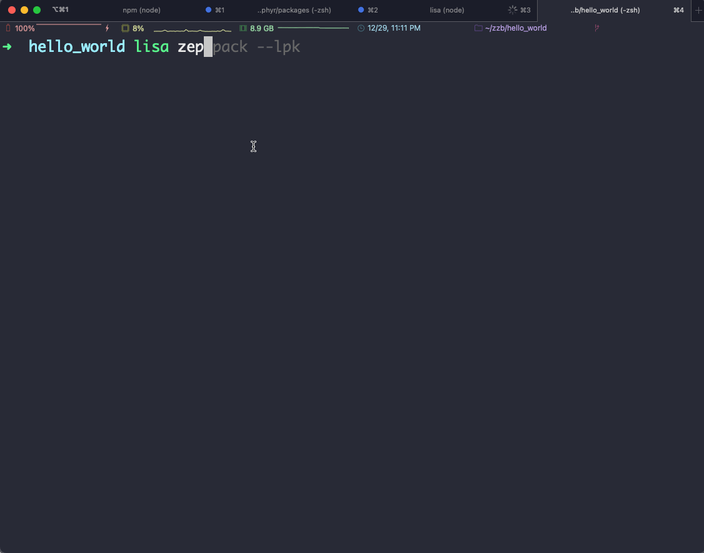

# 打包lpk包

:::tip
打包出lpk包依赖于当前工程的编译产物，请确保你已经执行过 `lisa zep build` 相关的应用程序编译操作。

该功能特性仅在 lisa zep 工具 `1.6.8` 及以上版本支持，请查看 [获取/更新](install) 章节进行工具的更新。
:::

```bash
lisa zep pack --lpk
```

执行该命令，按照提示的步骤进行输入，即可输出当前项目的lpk包。



### 多资源打包

上述为`hello_world`项目，输出的lpk包仅包含默认的 `zephyr.bin` ，烧录目标地址为 `0x0`。若想打包出能包含多资源的lpk包，方法如下：

以应用 `app_algo_hsd_sample_for_csk6` 为例，新建 `./resource/map.json` 文件，文件内容为：

```json
{
  "zephyr_partition": {
      "path": "build/zephyr/zephyr.bin",
      "address": "0x0",
      "required": true
  },
  "wifi_driver_storage": {
      "path": "",
      "required": false
  },
  "wifi_nvs_storage": {
      "path": "",
      "required": false
  },
  "storage_partition": {
      "path": "",
      "required": false
  },
  "algo_cp_partition": {
      "path": "resource/cp.bin",
      "required": false
  },
  "algo_res_partition": {
      "path": "resource/res.bin",
      "required": false
  }
}
```

该json文件记录的是资源表，其中key与设备树dts中的flash配置对应，value为一个object对象：

- path：资源文件所在路径，当required为true时必填

- address：资源文件烧录的目标地址，默认为设备树dts中的flash配置对应的地址

- required：是否必须，打包时进行检测，若为true时，当 path 路径的资源文件不存在，打包报错

配置好 `./resource/map.json` 后，执行 `lisa zep pack --lpk` 即可打包出多资源lpk包。