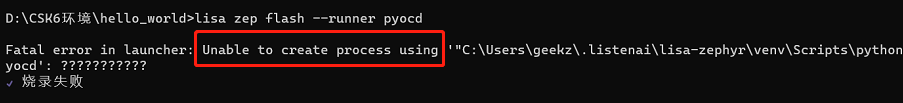

# 疑难解答

## lisa zep 命令报错


* windows平台下出现 `Unable to create process using xxx`




解决办法：

```bash
lisa zep doctor
```

如果依然无法编译，请检查你的环境变量是否已经设置，可参考下面链接:

- [基础命令](../lisa_plugin_zephyr/basic.md)

- [info zephyr](../lisa_plugin_zephyr/command_detail.md#info-zephyr)
