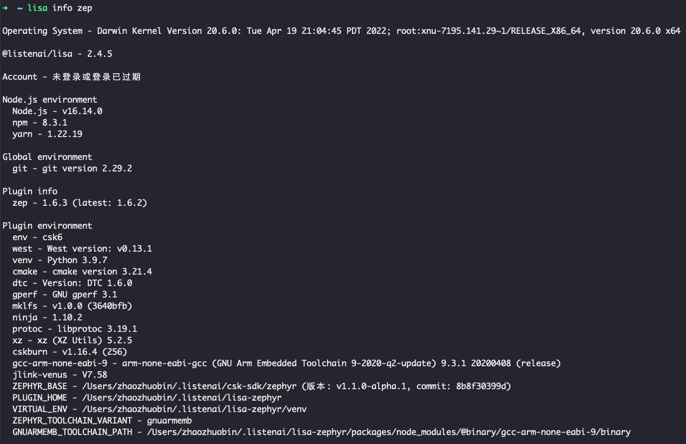

# 获取/更新

## 获取

可查看 [快速上手/安装开发工具](../../quick_start/start_env) 章节，进行首次工具的获取。

## 更新

#### 更新到 `latest` 版本

```bash
lisa update zephyr
```

执行该命令可将 Lisa插件-Zephyr 更新到最新的`latest`版本。

#### 更新到 `beta` 版本

```bash
lisa install @lisa-plugin/zephyr@beta -g
```

执行该命令可将 Lisa插件-Zephyr 更新到最新的`beta`版本。

#### 更新到 `指定` 版本

```bash
lisa install @lisa-plugin/zephyr@1.6.0 -g
```

执行该命令可将 Lisa插件-Zephyr 更新到最新的`指定的1.6.0` 版本。

## 查看当前 Lisa插件-Zephyr 版本

执行 `lisa info zephyr`，如下图红框显示的为当前 Lisa插件-Zephyr 版本。



