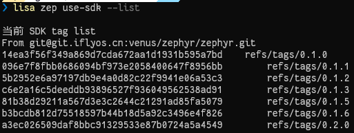

# SDK 操作

对 SDK 的相关操作，均通过以下命令，带上不同的选项和参数，完成不同的操作：

```bash
lisa zep use-sdk [opts] <args>
```

## 远端获取

```shell
lisa zep use-sdk [directory] [--from-git URL#TAG] [--manifest PATH]
```

#### 参数解析

- `directory` : 目录/路径，可为绝对路径或相对路径，会生成该目录，并将 SDK 拉取并初始化到该目录。

- `--from-git URL#TAG` : 指定远端仓库以及对应分支版本，用法: `--from-git https://cloud.listenai.com/zephyr/zephyr.git#v1.0.0`

- `--manifest PATH` : 指定提货单在远端仓库的位置，若不带该参数，默认为根目录的 `west.yml`。用法: `--manifest listenai/manifest.yml`

:::info
另可使用 `--default` 参数， `--from-git` 和  `--manifest` 均使用LSCloud上的SDK，并且拉取最新的 `TAG` ：
```shell
lisa zep use-sdk [directory] --default
```

`--from-git` 远程仓库为：`https://cloud.listenai.com/zephyr/zephyr.git`

`--manifest` 提货单为：`listenai/manifest.yml`

:::

#### 命令背后执行操作

此过程会在本地 **创建** 一个文件夹，并一步做好后续 SDK 的 **初始化**。

例如，运行：

```bash
lisa zep use-sdk ./my-zephyr-sdk --default
```

1、此命令创建 `./my-zephyr-sdk/.west`，并在 `config` 文件中设置 `manifest`， `manifest.path` 为 `--from-git` 代码仓中拉下来后的目录，由于该命令带了 `--default` 参数，所以 `manifest.file` 为 `listenai/manifest.yml` 。


2、然后解析清单文件 `listenai/manifest.yml`，并更新其中指定的每个项目。

3、随后会对 SDK 源码中的 `scripts/requirements.txt` 进行 install。

4、在 `Lisa Plugin Zephyr` 的执行时中设置环境变量 `ZEPHYR_BASE`，作为当前设置的 SDK，完成整个 SDK 的设置操作。

## 本地切换

```bash
lisa zep use-sdk [directory]
```

有些时候，开发者本地会存在多个不同的 CSK SDK，举个例子： `E:\\cloud-csk-sdk` 和 `E:\\gitlab-csk-sdk` 为两个不同代码仓初始化的 CSK SDK。

可以直接执行下列参考切换:

```bash
lisa zep use-sdk E:\cloud-csk-sdk
```

或

```bash
lisa zep use-sdk E:\gitlab-csk-sdk
```

## 查看版本分支列表

```bash
lisa zep use-sdk --list
```

直接执行该命令，会展示当前设置的 sdk 已发布的 tags 。



## 切换版本分支

```bash
lisa zep use-sdk --mr v1.0.0
```

直接执行该命令，会将当前设置的 sdk 切换到目标tag分支。

另外想要查看当前 sdk 是什么版本、分支，可执行 `lisa info zephyr` 查看 `ZEPHYR_BASE` 。

## 更新分支远端代码

```bash
lisa zep use-sdk --update
```

直接执行该命令，会对当前设置的 sdk ，对当前分支进行自动代码更新和modules更新。

:::info
通常情况下，仅在某些远端分支经常变动需要使用该命令。

如 `master` 分支，执行 `lisa info zephyr` 确保当前 `ZEPHYR_BASE` 的分支为 `master`, 否则需要 `--mr master` 切换到 `master` 分支，再进行更新。
:::

## 清空 SDK 配置

```bash
lisa zep use-sdk --clear
```

该命令会对当前设置好的 SDK `ZEPHYR_BASE` 进行解除。

:::info
此操作只解除 `ZEPHYR_BASE` 设置，不会对 SDK 的目录进行删除。
:::

## 安装 SDK requirements

```bash
lisa zep use-sdk --install
```

该命令会对当前设置好的 CSK SDK , 重新对 `scripts/requirements.txt` 进行 install。
