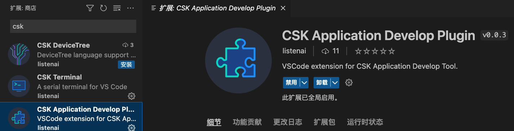
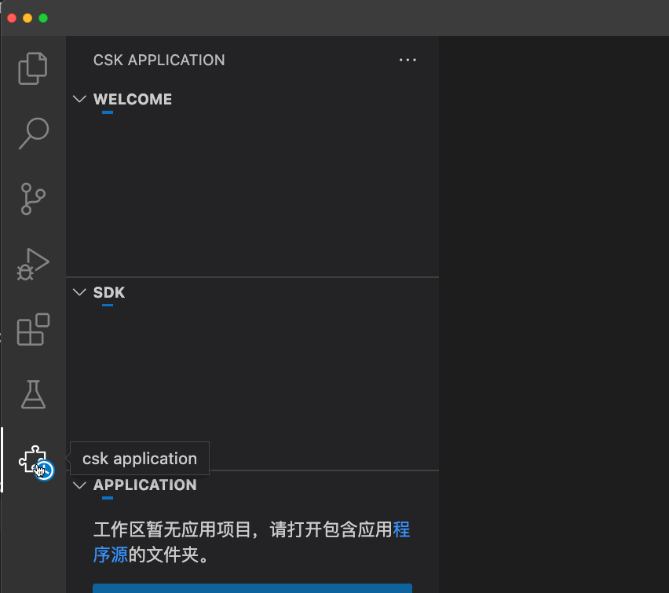
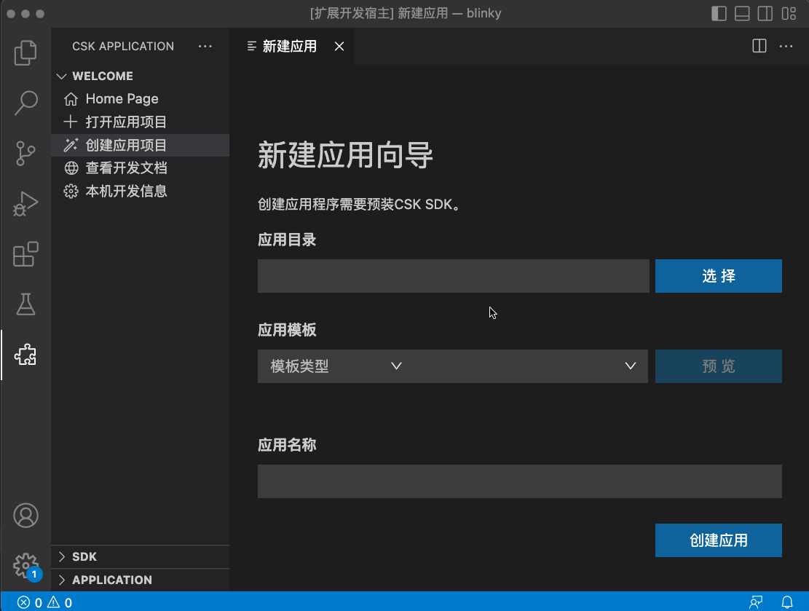
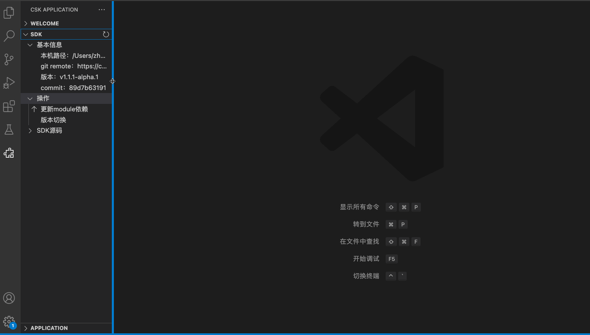
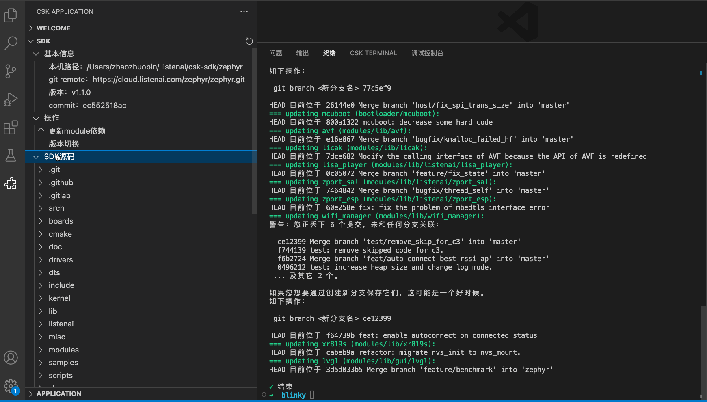
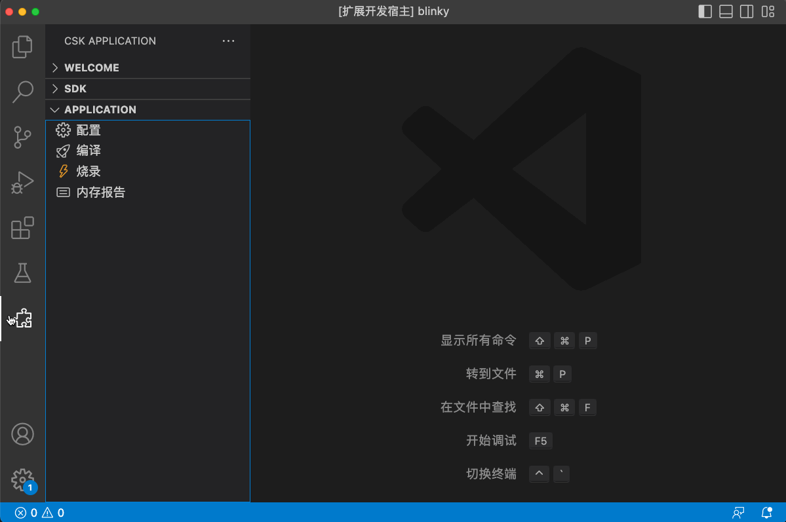

# CSK Application Develop Plugin 

csk-application-develop-plugin 是LISTENAI官方发布的IDE基础插件。用于在 Windows、macOS 或 Linux 上为 csk6芯片系列产品查看开发调试应用程序。

## 使用指引

点击左侧csk-application-develop-plugin插件图标，可唤出[csk-application-develop-plugin快捷菜单]：

## 新建应用

选择[WELCOME->创建应用项目]打开图形化界面。根据gui引导便能顺利创建新应用程序。

应用创建完毕后，会自动在新窗口打开新的应用。

## 打开已有应用

若要打开已有工程，可依次选择[WELCOME->打开应用项目]进行打开。

## 查看开发文档和开发信息

可在[WELCOME]菜单中选择想要的功能进行操作。

## SDK
[SDK]快捷菜单提供了查看SDK基本信息，升级SDK,以及查看SDK源码等功能。

### 切换sdk版本

### 查看sdk源码、更新依赖

## APPLICATION

当工作区间打开的是一个csk6系项目时，当前可进行简单的action项。

- 设置编译时的配置

- 编译、烧录

- 查看内存报告

