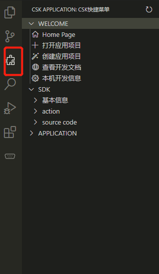
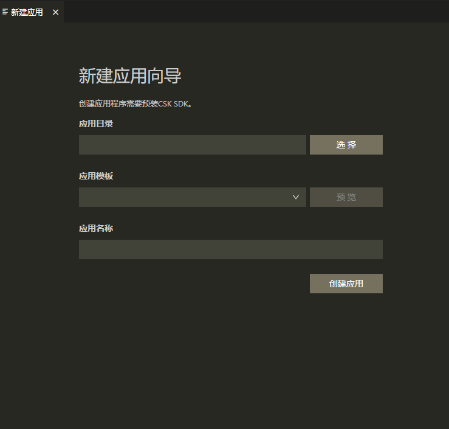
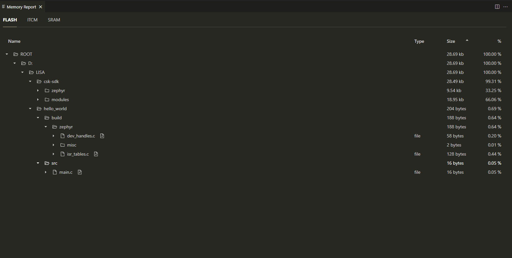

# CSK Application Develop Plugin 

CSK Application Develop Plugin 是LISTENAI官方发布的IDE基础插件。用于在 Windows、macOS 或 Linux 上为 csk6芯片系列产品查看开发调试应用程序。

### CSK Application Develop Plugin 主要特性

1. csk6 系列支持
2. 快速打开和创建应用项目
3. 命令行和图形界面

### 使用指引

点击左侧csk-application-basic插件图标，可唤出[CSK Application Develop Plugin 快捷菜单]，如图：

#### 新建应用

选择[WELCOME->创建应用项目]打开图形化界面。打开只需单击几下，即可使用“新建应用程序”向导顺利创建新应用程序。

应用创建完毕后，会自动在新窗口打开新的应用。

#### 打开已有应用

若要打开已有工程，可依次选择[WELCOME->打开应用项目]进行打开。

#### 查看开发文档和开发信息

可在[WELCOME]菜单中选择想要的功能进行操作。

#### SDK
[SDK]快捷菜单提供了查看SDK基本信息，升级SDK,以及查看SDK源码等功能。

#### 内存报告

该扩展提供内存报告，显示设备应用程序中ROM和RAM等内存使用的百分比和大小。

查看内存占用报告之前需要在VS code打开zephyr项目并“构建”它。

- 使用方式
    按下“Ctrl+Shift+P”组合键以显示“命令面板”，然后键入“Memory Report”命令。按“Enter”，即可打开内存报告。

“内存”报告通过树视图的形式轻松显示每个节点在设备上占用的内存量。

