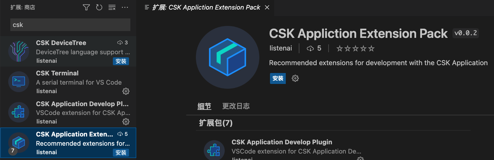

# 概述

**CSK Application Extension Pack** 是 **聆思智能** 提供的**VSCode扩展集合包**，它包括为 CSK 应用开发推荐的所有扩展。

### 包含的插件：

* [CSK Application Develop Plugin](https://marketplace.visualstudio.com/items?itemName=listenai.csk-application-basic)
    * 用于在Windows、macOS或Linux上开发 CSK 应用程序
    * 包括编译后的内存可视化

* [CSK DeviceTree](https://marketplace.visualstudio.com/items?itemName=listenai.csk-devicetree)
    * 设备树可视化

* [CSK Terminal](https://marketplace.visualstudio.com/items?itemName=listenai.csk-terminal)
    * 串口终端

* [devicetree](https://marketplace.visualstudio.com/items?itemName=plorefice.devicetree)
    * 支持DeviceTree语言

* [C/C++](https://marketplace.visualstudio.com/items?itemName=ms-vscode.cpptools)
    * C/C++语言支持，具有智能感知、调试和代码浏览功能
    
* [Cortex Debug](https://marketplace.visualstudio.com/items?itemName=marus25.cortex-debug)
    * ARM Cortex-M GDB调试器支持

* [CMake](https://marketplace.visualstudio.com/items?itemName=twxs.cmake)
    * CMake语言支持

