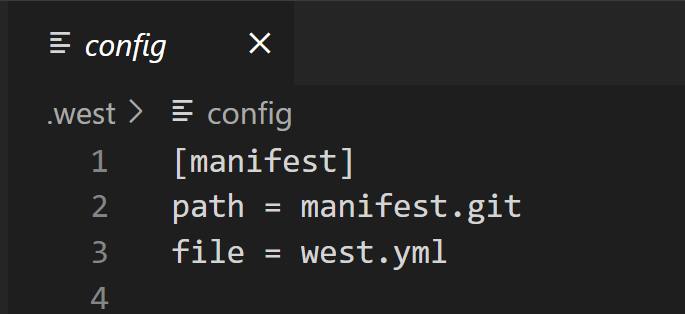
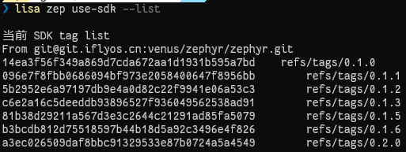

# CSK SDK 操作

对 CSK SDK 的相关操作，均通过以下命令，带上不同的选项和参数，完成不同的操作：

```bash
lisa zep use-sdk [opts] <args>
```

## 从远端获取CSK SDK到本地

```bash
lisa zep use-sdk [directory] [--from-git URL#TAG] [--manifest PATH]
```

此过程会在本地 **创建** 一个文件夹，并一步做好后续 SDK 的 **初始化**。

其中参数 `--manifest` 默认值为 `west.yml`。

例如，运行：

```bash
lisa zep use-sdk ./my-zephyr-sdk --from-git https://cloud.listenai.com/zephyr/manifest.git
```

1、此命令创建 `./my-zephyr-sdk/.west`，并在 `config` 文件中设置 `manifest`， `manifest.path` 为 `--from-git` 代码仓中拉下来后的目录，由于该命令没有带 `--manifest` 参数，所以 `manifest.file` 为默认的 `west.yml` 。




2、然后解析清单文件 `west.yml`，并更新其中指定的每个项目。

3、随后会对 SDK 源码中的 `scripts/requirements.txt` 进行 install。

4、在 `Lisa Plugin Zephyr` 的执行时中设置环境变量 `ZEPHYR_BASE`，作为当前设置的 SDK，完成整个 SDK 的设置操作。

通过上述文档，你已经基本了解从远端获取SDK的方式。下面还有几个高级用法：

**A. 设置不同的** `manifest.file`

若清单文件不是 `--from-git` 代码仓根目录的 `west.yml`，可以在带上 `--manifest` 参数。

比如:

```bash
lisa zep use-sdk ./my-csk-sdk --from-git git@git.iflyos.cn:venus/zephyr/zephyr.git --manifest listenai/manifest.yml
```

该命令与上述流程一致，仅在设置 `manifest.file` 时，值为 `listenai/manifest.yml`。然后解析该清单文件，进行后续 SDK 的设置操作。

**B. 设置不同的 SDK 版本**

参数 `--from-git` 的值可带 `TAG`，目前不带时，会使用默认分支。

比如：

```bash
lisa zep use-sdk ./my-zephyr-sdk --from-git https://cloud.listenai.com/zephyr/manifest.git#0.1.5
```

该命令与上述流程一致，仅在获取 `--from-git` 代码仓时，使用对应的分支版本。此处为 `0.1.5` ，开发者可自行选择对应分支版本。

## 更新本地的 CSK SDK

**NOTE**: 该功能特性仅在插件 `1.4.1` 及以上版本支持，执行 `lisa info zephyr` 检查本地的插件版本，并可通过 `lisa update zephyr` 更新到最新插件版本。

```bash
lisa zep use-sdk --update
```

直接执行该命令，会对当前设置的 sdk ，对当前分支进行自动代码更新和modules更新。

## 查看当前 SDK 的版本分支列表

**NOTE**: 该功能特性仅在插件 `1.4.1` 及以上版本支持，执行 `lisa info zephyr` 检查本地的插件版本，并可通过 `lisa update zephyr` 更新到最新插件版本。

```bash
lisa zep use-sdk --list
```

直接执行该命令，会展示当前设置的 sdk 已发布的 tags 。




## 切换当前 SDK 到其他版本分支

**NOTE**: 该功能特性仅在插件 `1.4.1` 及以上版本支持，执行 `lisa info zephyr` 检查本地的插件版本，并可通过 `lisa update zephyr` 更新到最新插件版本。

```bash
lisa zep use-sdk --mr 0.2.0
```

直接执行该命令，会将当前设置的 sdk 切换到目标tag分支。

另外想要查看当前 sdk 是什么tag分支，可执行 `lisa info zephyr` 查看 `ZEPHYR_BASE` 。

## 切换本地别的CSK SDK路径

```bash
lisa zep use-sdk [directory]
```

有些时候，开发者本地会存在多个不同的 CSK SDK，举个例子： `E:\\cloud-csk-sdk` 和 `E:\\gitlab-csk-sdk` 为两个不同代码仓初始化的 CSK SDK。

可以直接执行下列参考切换:

```bash
lisa zep use-sdk E:\cloud-csk-sdk
```

或

```bash
lisa zep use-sdk E:\gitlab-csk-sdk
```

## 清空当前CSK SDK

```bash
lisa zep use-sdk --clear
```

该命令会对当前设置好的 CSK SDK `ZEPHYR_BASE` 进行解除。

## 重新安装CSK SDK的requirements

```bash
lisa zep use-sdk --install
```

该命令会对当前设置好的 CSK SDK , 重新对 `scripts/requirements.txt` 进行 install。
