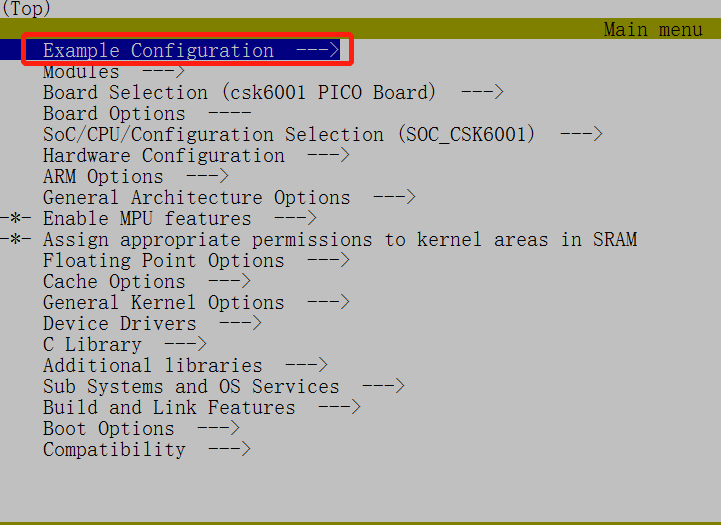
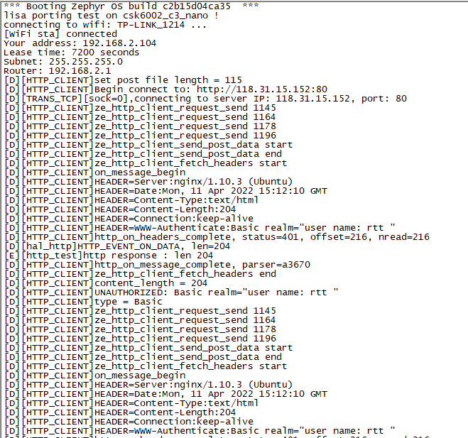
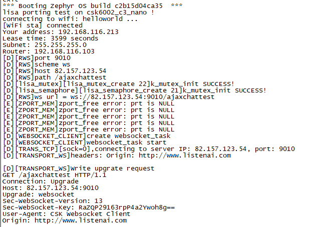

# Lisa Porting

本节将主要介绍Lisa Porting功能模块，通过本章节我们将掌握：


* 对Lisa Porting的基本认识


* 了解Lisa Porting包含的OS与Net功能


* 在CSK6开发板上运行Lisa Porting例程

**NOTE**: 本章节使用的实验硬件平台为【NanoKit开发板&6002_c3在线模组】，对应板型为：csk6002_c3_nano

本章节使用的Sample为 samples/boards/csk6001/apps/lisa_porting


---

## Lisa Porting简介

Lisa Porting是聆思基于市场主流的 RTOS 和芯片平台，定义的一个介于底层驱动与上层应用的中间件模块，可用于屏蔽不同RTOS API的差异，从而减少上层应用在不同RTOS间的移植工作量。

Lisa Porting包括 **Lisa_OS** 和 **Lisa_Net** 两个子功能模块，它们的功能如下：


* Lisa_OS：包含线程、互斥锁、信号量、队列、定时器及内存单元等相关接口


* Lisa_Net：包含Http、Websocket等网络应用接口

Lisa Porting及其功能模块在Zephyr RTOS中的关系如下方架构图所示：


如图，使用Lisa Porting提供的OS和Net接口开发的应用Lisa Application，通过Lisa Porting间接调用了Zephyr RTOS的系统级能力与各类资源，包括Zephyr标准的http、websocket接口。

## Lisa Porting 例程

在SDK提供的Lisa Porting例程中，将提供对Lisa_OS、Lisa_Net(http、websocket)功能模块的调用演示，接下来我们先创建一个Lisa Porting例程。

**Step 1： 创建Sample**
在希望创建此工程的目录下执行  `lisa zep create` 指令，在模板选择中依次选择 boards/csk6001/apps/lisa_porting

**Step 2： 查看Sample**

Lisa Porting的工程结构如下：

```none
lisa_porting
├── boards
├── lisa_net
├── lisa_os
└── tests
```


* **lisa_net** ：lisa_net功能模块的源码文件，主要包括http、websocket两部分；


* **lisa_os** ：lisa_net功能模块的源码文件，包含诸如线程、互斥锁、信号量、队列、定时器及内存单元等代码实现；


* **tests** ：例程应用层调用的源码，默认例程演示功能为lisa_os。

**Step 3： 编译与烧录**

在当前工程目录中执行 `lisa zep build -b csk6002_c3_nano` 指令，指定我们使用的开发板板型进行编译。

编译完成后，执行 `lisa zep flash --runner pyocd` 指令进行固件烧录

Lisa Porting例程默认的演示功能为lisa_os(tests/main.c → void main → lisa_os_test)，lisa_os_test对lisa_os提供的能力进行了调用演示，更详细的Lisa_OS API说明可前往本章节末下载《LISA OS API 参考手册》。

## Lisa_Net功能：lisa_http

通过对Lisa Porting例程进行简单地修改，我们可以运行http的简单应用，实现http GET和POST操作。

### 修改代码

1.修改tests/main.c文件，注释掉除lisa_https_test之外的其他应用调用入口，如下：

```C
// main.c
void main(void)
{
        printk("lisa porting test on %s !\n", CONFIG_BOARD);

        _wifi_init(); // 进行wifi模块的初始化
        k_sleep(K_MSEC(5000)); //wait for wifi init over

        lisa_https_test();
        // lisa_os_test();
        // lisa_websocket_test();

        while (1) {
                k_sleep(K_MSEC(5000));
                printk("lisa porting test on !\n");
        }
}
```

2.修改tests/tester_https.c文件，将相关的HTTP应用参数更换为iflyos相关的参数，如下：

```C
//tester_https.c
//同时支持带IP的URL,如http://118.31.15.152/service/echo
#define HTTP_POST_URL ("http://auth.iflyos.cn/oauth/ivs/device_code")
#define HTTP_GET_URL ("http://listenai-firmware-delivery.oss-cn-beijing.aliyuncs.com/test/test.txt")
#define HTTP_DOWNLOAD_URL                                                                   \
        ("http://listenai-firmware-delivery.oss-cn-beijing.aliyuncs.com/test/scanpen/ota_test/" \
         "flashboot.bin")
```

### 修改编译选项

1.执行以下指令启用menuconfig编译选项配置

```shell
lisa zep build -b csk6002_c3_nano -t menuconfig
```

2.在 `Example Configuration` 选项中修改WIFI相关配置




3.在 `Modules/zport_esp` 选项中添加对应第三方文件如下：


### 编译&烧录&观察

1.执行以下指令进行工程编译

```shell
lisa zep build -b csk6002_c3_nano
```

2.执行以下指令进行固件烧录

```shell
lisa zep flash --runner pyocd --frequency 20000000
```

3.完成固件烧录后，使用串口工具观察串口日志输出如下：




## Lisa_Net功能：lisa_websocket

通过对Lisa Porting例程进行简单地修改，我们可以实现websocket的简单应用，通过websocket连接iflyOS EVS服务，并进行数据收发测试。

### 修改代码

1.修改tests/main.c文件，注释掉除lisa_https_websocket之外的其他应用调用入口，如下：

```C
// main.c
void main(void)
{
        printk("lisa porting test on %s !\n", CONFIG_BOARD);

        _wifi_init(); // 进行wifi模块的初始化
        k_sleep(K_MSEC(5000)); //wait for wifi init over

        // lisa_https_test();
        // lisa_os_test();
        lisa_websocket_test();

        while (1) {
                k_sleep(K_MSEC(5000));
                printk("lisa porting test on !\n");
        }
}
```

2.修改tests/tester_websocket.c文件，将相关的websocket应用参数更换为iflyos ivs相关的参数，如下：

```C
#define WS_TEST_SCHEME "ws"
#define WS_TEST_HOST_1 "82.157.123.54"
#define WS_TEST_HOST_2 "ivs.iflyos.cn"
#define WS_TEST_PORT_1 "9010"
#define WS_TEST_PORT_2 "80"
```

### 修改编译选项

1.执行以下指令启用menuconfig编译选项配置

```shell
lisa zep build -b csk6002_c3_nano -t menuconfig
```

2.在 `Example Configuration` 选项中修改WIFI相关配置


3.在 `Modules/zport_esp` 选项中添加对应第三方文件如下：


### 编译&烧录&观察

1.执行以下指令进行工程编译

```shell
lisa zep build -b csk6002_c3_nano
```

2.执行以下指令进行固件烧录

```shell
lisa zep flash --runner pyocd --frequency 20000000
```

3.完成固件烧录后，使用串口工具观察串口日志输出如下：





---

## 资料下载

`LISA OS API 参考手册V1.0`
