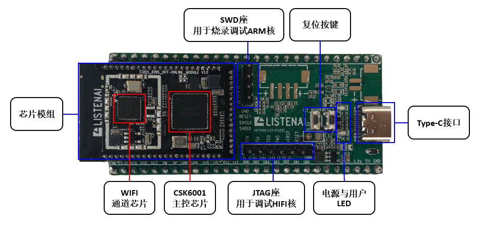
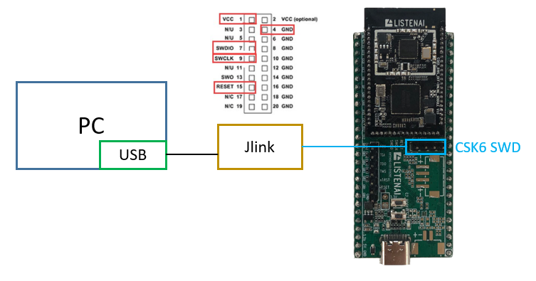
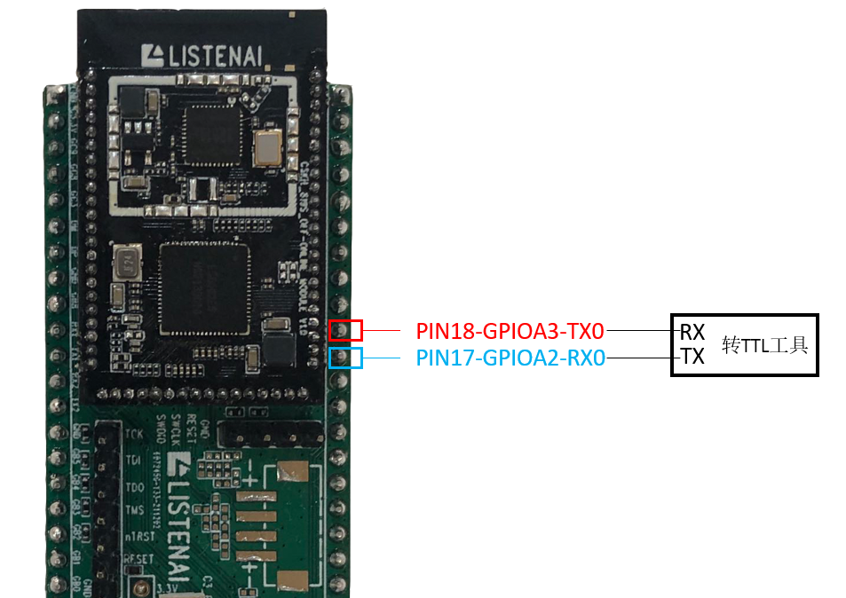
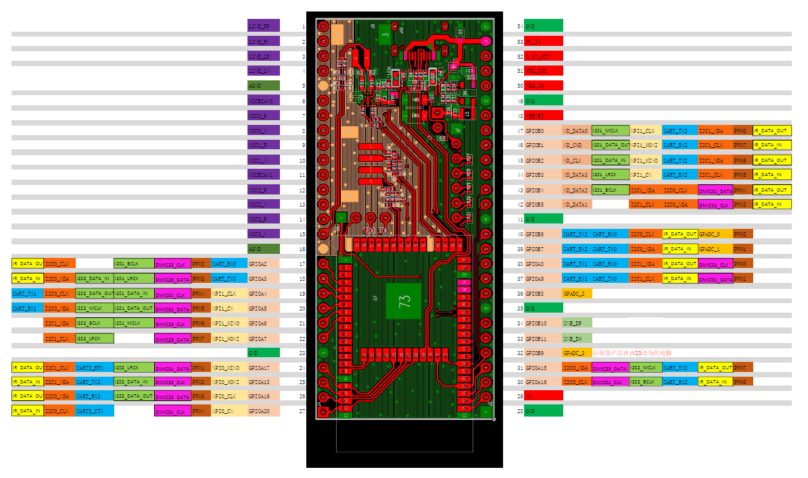

# Pico开发板

本节主要讲解CSK6芯片配套的开发板硬件平台。通过本章节，你将了解：

* 开发板套件的组成与特性

* 开发板的基础使用方法

* 开发板相关资料的下载

## Pico简介

CSK6 Pico是聆思早期推出的一款小型化开发板，该开发套件围绕CSK6核心模组进行设计，方便用户快速了解并使用CSK6芯片。

## 开发板的使用

### 板载资源

* 芯片模组：通过排针或邮票孔与Pico底板进行连接，模组的引脚在Pico底板上会以2.54mm间距引脚的形式引出，方便用户开发与调试

* Type-C接口：支持通过USB线连接Pico底板的Type-C接口进行供电，标准电压为5V

* LED：电源LED(红)在开发板正常上电后保持点亮状态，用户LED与CSK芯片GPIO连接，用户可将其作为外设使用

* 复位按键：分别为CSK6001芯片和WIFI IC的复位按键

* SWD座：可外接Jlink或DAPLink，方便用户对ARM核进行烧录与调试

* JTAG座：可外接JTAG，方便用户对HIFI核进行烧录与调试，普通业务开发者可忽略

### 连接Jlink

Pico底板上预留了用于连接Jlink调试器的SWD接口排针，在进行固件烧录与调试前需进行连接，如图：

### 连接调试串口

在开发过程中，我们将经常使用uart串口观察开发板输出信息，CSK6 Pico开发板的uart0默认引脚为GPIOA2[PIN17-RX0]与GPIOA3[PIN18-TX0]，可参照背面引脚丝印，通过USB转TTL工具连接此端口观察调试信息输出，如图：

更多的GPIO引脚信息，可参照下方开发板资料中的硬件原理图与IO口功能映射图。

### 其他引脚与外设的使用

CSK6芯片具备丰富的外设接口，且其引脚支持高灵活的映射，因此用户可根据自己的需要,参照引脚功能映射图或芯片手册选择各IO口映射的功能(详见资料下载章节)。

## 开发板资料下载

`CSK6 Pico原理图`

`纯离线模组IO MAP`

`离在线模组(C3)IO MAP`
